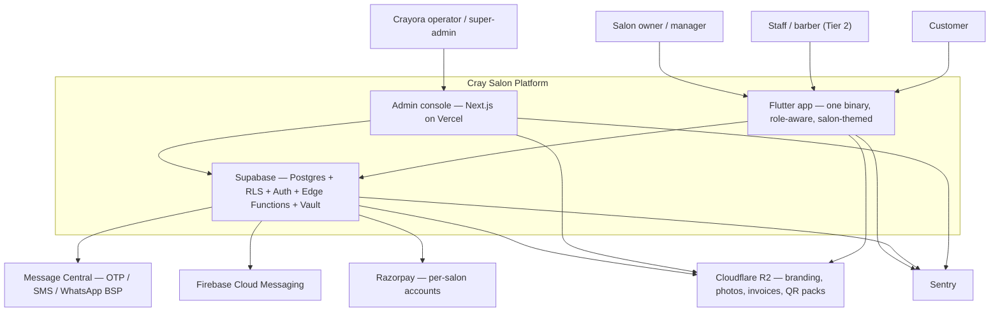
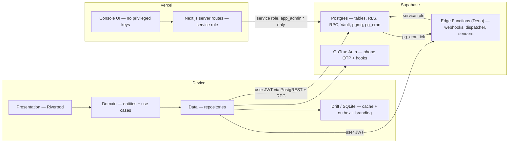

# Cray Salon — Technical Architecture

**Companion to** `Cray-Salon-PRD-v4.md` (what & why) and `Cray-Salon-Blueprint.pdf` (the pitch).
This document is the **how**: structure, boundaries, invariants, and the decisions a future
session must not silently re-litigate.

| | |
|---|---|
| **Version** | 2.6 — message control split into three tiers; OTP is unbrandable by construction |
| **Supersedes** | v1.0–v2.5 (see revision history below) |
| **Status** | Approved for build. No open architectural questions; ⚖️ items need professional sign-off (PRD §16A) |
| **Owner** | Jyotiranjan / Crayora |
| **Authoritative for** | tenancy model, schema shape, trust boundaries, integrity rules, mechanisms |
| **Not authoritative for** | feature scope, copy, pricing (PRD v4) · visual design (`DESIGN.md`) · build order (`PHASES.md`) · screen and API inventory (`IMPLEMENTATION.md`) |

> **Reading order for an implementation session:** **`RULES.md`** (always) → §2 (drivers) → §4
> (containers) → §5 (tenancy — read fully, every time) → the section for your milestone → §20
> (ADRs).
>
> **`RULES.md` is the compressed, imperative form of this document.** If you read only one file
> before writing code, read that one. This document explains *why* each rule exists; RULES.md
> states what you must do. Where they appear to disagree, they don't — come back here and read
> the reasoning.

### Revision history

The body of this document describes the **current** design. This table exists so a decision that
looks arbitrary can be traced to the moment it was made.

| Ver | Change | Driver |
|---|---|---|
| 1.0 | Original, against PRD v3's self-serve model | — |
| 2.0 | Sales-led model: Crayora provisions salons from a console; customers bind to exactly one salon; per-salon white-labelling; per-salon secrets | Business model change |
| 2.1 | Support-mediated transfer; wallet top-ups non-refundable; **no manual wallet adjustment for anyone**; each salon sends from its own messaging accounts | Owner decisions |
| 2.2 | **Salon code before login**, so the salon is known at the first OTP; OTP refused without salon context; branding fetchable pre-auth | Owner decision |
| 2.3 | Legal review: paid credit can never expire; purge splits personal from financial; credit settled on salon exit; licensing boundaries recorded | Indian regulatory review |
| 2.4 | No DLT registration anywhere — Message Central is top-up-and-send | Provider fact |
| 2.5 | *(superseded by 2.6)* | — |
| **2.6** | **Message control in three tiers; the OTP is unbrandable by construction and no code may attempt it** | Provider fact |

Three of those changes *removed* capability rather than adding it — manual wallet adjustment,
paid-credit expiry, and OTP templating. That is the preferred direction in this codebase: a
capability that does not exist cannot be misused, misconfigured, or turned on by a support
request. See **RULES.md §2**.

## 1. Scope

Cray Salon is a **multi-tenant, per-salon white-labelled SaaS retention loop** for Indian local
salons: an install-first Flutter app - **Android at launch, iOS-ready** - plus a Crayora operations console (Next.js on
Vercel), on a managed serverless backend (Supabase). Many salons, one codebase, one database,
hard row-level isolation — and to each customer it looks like their own salon's app.

Optimised for six things, in priority order:

1. **Isolation correctness** — a cross-tenant leak is an extinction event for a B2B SaaS.
2. **Binding integrity** — one phone, one active salon binding, changeable only by audited
   Crayora support. This is a core invariant, not a preference.
3. **Financial integrity** — the wallet is store credit; ledgers must be provably append-only.
4. **Capture reliability** — every automation triggers off *"visit marked complete."* If that
   tap fails on bad salon wi-fi, the entire product stops working.
5. **Unit economics** — free FCM push must genuinely displace paid WhatsApp, and the system must
   be able to *prove* it did.
6. **Operational throughput** — a non-engineer provisions a salon in under 30 minutes, and never
   touches a database.

---

## 2. Architectural drivers

The forces behind every decision below. When a trade-off appears, resolve it against this table,
in order.

| # | Driver | Source | Architectural consequence |
|---|---|---|---|
| D1 | No salon may ever read another salon's row | PRD §7, §16 | RLS **enabled and forced** everywhere + scoped data layer + catalogue-driven leak test (§5.8) |
| D2 | Wallet/loyalty append-only, non-cash | PRD §8.5 | Ledger writes only via `SECURITY DEFINER` functions; `UPDATE`/`DELETE` revoked *and* trigger-blocked (§6.4) |
| D3 | Mark-complete must work offline | PRD §15 | Client outbox + idempotent server RPCs; **money never mutates offline** (§10) |
| D4 | Push before paid WhatsApp | PRD §10.1, §12 | Delivery-**ack** protocol + escalation windows + per-channel metering (§12) |
| **D5** | **Salons exist only via the console** | PRD §6, §11 | Provisioning is one transactional admin RPC; **no SQL, no deploy, no in-app wizard** (§5.7, §14) |
| **D6** | **One phone has one *active* salon binding** | PRD §6.5 | Global `customer_identities` uniqueness; no switch API in the app; audited super-admin unbind/transfer; claim-based RLS for customers (§5.4) |
| **D13** | **No human at the salon can move money** | PRD §8.5, §9.5 | Five enumerable balance-changing paths; no owner/manager adjustment control, endpoint, or permission (§6.4) |
| **D14** | **Each salon messages from its own accounts** | PRD §12.1 | Two messaging identities; per-salon credentials and template state; ladder degrades when a salon is not yet approved (§12) |
| **D11** | **The app must look like the salon's own** | PRD §6.6 | Server-driven theme + assets, cached offline; launcher icon handled honestly (§7) |
| **D12** | **Per-salon API keys live in the platform** | PRD §16 | Vault-encrypted credentials, write-only UI, service-role-only decryption (§8) |
| D7 | Patchy connectivity, low-end Android | PRD §15 | Local SQLite cache, keyset pagination, pre-aggregated dashboard reads (§6.8) |
| D8 | India regulatory: DPDP, consumer protection, PPI-avoidance | PRD §16, §16A | Per-purpose consent ledger, anonymise-not-delete, closed-loop credit only (§15.4, §15.6) |
| D9 | Crayora runs the SaaS without touching the DB | PRD §11 | Admin plane on Vercel, service-role server-side only, audit written inside the same transaction (§14) |
| D10 | Ship Tier 1 before Tier 2/3 | PRD §5, §21 | Tier 2/3 tables *designed* now, *created* later; no schema rewrite at Tier 2 (§6.2) |

---

## 3. System context



**Trust boundaries.** The Flutter app is **untrusted** — it holds a user JWT and nothing else.
The Vercel console is **partially trusted**: its *browser* half is untrusted, its *server* half
holds the service role. Every third-party credential — platform-wide and per-salon — lives only
in Edge Function secrets, Vercel server environment, or Supabase Vault. The APK contains the
Supabase URL and the **anon** key, both public by design and useless without RLS-passing claims.

---

## 4. Container view — what runs where



| Concern | Runs in | Identity | Why there |
|---|---|---|---|
| Reads/writes of tenant data | Postgres via PostgREST | end-user JWT | RLS is the enforcement point; no middle tier to bypass it |
| Multi-row invariants (bind, wallet post, booking create, mark-complete) | Postgres `SECURITY DEFINER` RPC | end-user JWT | Atomicity and invariants next to the data; still RLS-checked at entry |
| Anything touching a third-party secret | Edge Function | service role | Secrets must never reach a device or a browser |
| Salon provisioning, branding publish, credential writes | Next.js server route → `app_admin.*` RPC | service role | Audit is written inside the same transaction, so it cannot be skipped |
| Scheduled scans | `pg_cron` → dispatcher Edge Function | service role | Deterministic, observable, retryable |
| Fan-out after a domain event | `domain_events` outbox → `pgmq` → worker | service role | Transactional; survives crashes; safe under offline replay |

**Rule:** an Edge Function that only reads/writes tenant data and touches no secret is a smell —
prefer an RPC. Edge Functions exist for *secrets, external I/O, and orchestration*.

---

## 5. Tenancy, identity & binding — the core of the system

> Read this section in full before writing any query.
> **Every table carries `salon_id`. Every query is tenant-scoped. RLS is enabled *and forced* in
> the database.**

### 5.1 Principal types

| Principal | Auth pool | Tenancy | Resolved via |
|---|---|---|---|
| **Staff principal** (owner / manager / staff) | Supabase Auth | exactly one salon | `public.users.salon_id` → JWT claim |
| **Customer principal (bound)** | Supabase Auth | exactly **one active binding** | `public.customer_identities` → JWT claim |
| **Customer principal (unbound)** | Supabase Auth | **none** | authenticated but tenant-less; can call exactly two RPCs (§5.5) |
| **Platform admin** (operator / super-admin) | Supabase Auth + **MFA**, separate table | **no tenant, ever** | `platform_admins`; never granted a `salon_id` claim |

Because of D6, *every* tenant principal now has exactly one salon. v1.0's split authorisation
path is deleted.

### 5.2 Claims

A **Custom Access Token Hook** (Postgres function invoked by GoTrue at token mint) injects:

```jsonc
{
  "app_role": "owner|manager|staff|customer|customer_unbound|platform_admin",
  "salon_id": "uuid",                                 // absent for customer_unbound and platform_admin
  "perms":    { "billing": true, "settings": true },  // managers/staff granular permissions
  "cver":     3                                       // claims version; bump to force a refresh
}
```

Tokens are short-lived (1h). **Claims are a cache, not the source of truth.** Anything revocable
mid-session — salon suspension, role change, permission change, a fresh binding, **a transfer** —
is re-checked in the database, never trusted from the token alone. Binding and transfer both bump
`cver`, which forces the client to refresh and pick up its new `salon_id`.

**OTP delivery — the Send SMS Hook (confirmed, v2.1).** Supabase Auth keeps ownership of code
generation, sessions and refresh rotation; only *delivery* is ours:

1. An Edge Function `sms-hook` receives `{ sms, user }` — `sms.to` is the number,
   `sms.metadata.token` is the code Supabase generated — and forwards it to Message Central.
2. The **platform** fallback credentials live in Edge Function secrets
   (`MESSAGE_CENTRAL_AUTH_KEY`, `MESSAGE_CENTRAL_CUSTOMER_ID`); **per-salon** credentials come
   from Vault via `salon_integrations` (§8). Neither ever reaches the app.
3. Dashboard: *Authentication → Hooks → Send SMS hook* (HTTPS, pointing at the deployed
   function), then *Authentication → Providers → Phone → delivery = Hook*.
4. `supabase.auth.signInWithOtp()` then works unchanged on the client.

Three hardening requirements the happy-path setup omits, all mandatory:

- **Verify the hook signature.** Supabase signs hook requests; the function must reject anything
  unsigned or mis-signed. An open hook URL is a free-SMS machine pointed at Crayora's Message
  Central bill.
- **Never log `sms.metadata.token`**, and never include it in a Sentry breadcrumb or an error
  payload.
- **Rate-limit before sending** (§15.3) — the hook is the last place to stop an OTP flood, and
  every send is real money.

**Sender routing (v2.2) — how the hook knows which salon's account to send from.** The hook is
invoked by GoTrue and receives only `sms.to` and the token; it gets no client-supplied context,
and it must not trust any if it did. So it resolves the salon **server-side, from our own
tables**, in this order:

```
resolve_otp_sender(phone) :=
  1. join_intents      WHERE phone_hash = h AND expires_at > now()   -> that salon   (first OTP)
  2. customer_identities WHERE phone_hash = h                        -> that salon   (returning)
  3. users             WHERE phone_hash = h AND active               -> that salon   (owner/staff)
  4. otherwise                                                       -> REFUSE
```

`join_intents` is what the reordered flow buys us:

```sql
create table public.join_intents (
  phone_hash bytea       primary key,
  salon_id   uuid        not null references public.salons(id),
  created_at timestamptz not null default now(),
  expires_at timestamptz not null default now() + interval '15 minutes'
);
```

The client calls a public, rate-limited `start_join(code, phone)` **before** `signInWithOtp()`.
That validates the code against an `active` salon, upserts the intent, and only then does the
app request the OTP. The hook fires moments later, finds the intent, decrypts that salon's
Message Central credentials, and sends. The intent is consumed at binding and expires on its own
if abandoned.

**Rule 4 is the security win.** In v2.1, anyone with the APK could request an OTP for any number,
and the only defence was a rate limit. Now a request with no salon context is **refused
outright** — there is no code path that sends. The reorder narrowed the attack surface rather
than widening it (ADR-28).

**No registration dependency on the OTP path (v2.6).** Message Central is a **top-up-and-send**
arrangement: no DLT registration is required from Crayora or from any salon. A newly provisioned
salon sends OTP from its own Message Central account **from its first day** — no waiting state, no
staged switchover.

```
salon Message Central credentials present and healthy  -> send on the SALON'S account
otherwise                                              -> send on CRAYORA'S account,
                                                          stamp otp_fallback_used + reason
```

**The OTP message itself cannot be branded** (§12.5a): both its body and its sender header belong
to Message Central. Do not write code that templates or validates it. The salon branding on this
step comes from the app screen the customer is watching while the code arrives — which is exactly
what the code-first reorder bought.

The fallback now covers only genuine faults — `credentials_missing`, `credentials_untested`,
`send_failed` — and every one of them is alerted, because none is a normal state. Failing closed
would turn a lapsed Message Central subscription at one salon into a total login outage for that
salon's customers: an unacceptable coupling between a billing problem and availability (ADR-29).

**Compliance sits with the provider.** Because Message Central carries its own registrations and
templates, no per-salon telecom paperwork gates onboarding. The only per-salon messaging
paperwork anywhere in the product is **Meta approval of that salon's WhatsApp templates**, which
gates one rung of the ladder and nothing else (§12.2).

### 5.3 The RLS pattern (use this shape everywhere)

Helpers are `stable` so PostgreSQL evaluates them **once per statement** as an InitPlan rather
than once per row — the difference between a fast dashboard and a timeout at 10k rows.

```sql
create schema if not exists app;

create or replace function app.current_salon_id() returns uuid
language sql stable security definer set search_path = '' as $fn$
  select nullif(current_setting('request.jwt.claims', true)::jsonb ->> 'salon_id', '')::uuid
$fn$;

-- Writes are blocked for suspended / read-only-grace tenants, in the database.
create or replace function app.salon_writable(p_salon uuid) returns boolean
language sql stable security definer set search_path = '' as $fn$
  select exists (select 1 from public.salons s
                  where s.id = p_salon and s.status = 'active')
$fn$;
```

Canonical policy set for a tenant table:

```sql
alter table public.bookings enable row level security;
alter table public.bookings force  row level security;   -- the table owner is NOT exempt

create policy bookings_tenant_select on public.bookings for select to authenticated
  using ( salon_id = app.current_salon_id() );

create policy bookings_tenant_insert on public.bookings for insert to authenticated
  with check ( salon_id = app.current_salon_id() and app.salon_writable(salon_id) );

create policy bookings_tenant_update on public.bookings for update to authenticated
  using      ( salon_id = app.current_salon_id() )
  with check ( salon_id = app.current_salon_id() and app.salon_writable(salon_id) );
```

Row-ownership *within* a salon (a customer seeing only their own bookings) is a **second,
narrower policy**, not a replacement for the tenant policy:

```sql
create policy bookings_customer_own on public.bookings for select to authenticated
  using ( salon_id = app.current_salon_id()
          and customer_id = app.current_customer_id() );
```

Four things that are easy to get wrong and expensive to discover later:

- **`force row level security`** on every tenant table. Without it the owning role bypasses RLS,
  and a migration or a mis-scoped connection silently sees everything.
- **No `to public` policies.** Always `to authenticated`, or `to anon` deliberately and narrowly
  (only the public salon-code resolver, §5.6).
- **`(select auth.uid())`, never bare `auth.uid()`** inside a policy — the subquery form is
  hoisted out of the per-row loop.
- **`DELETE` policies exist for almost nothing.** Statuses, not deletes (PRD §8.4).

### 5.4 Exclusive binding and the support-only transfer (D6) — the mechanism

> **One phone number has exactly one *active* salon binding.** Enforced by a global constraint,
> not by UI and not by application logic. It changes only through an audited Crayora action.

```sql
create table public.customer_identities (
  phone_hash   bytea      primary key,          -- HMAC-SHA256(phone, pepper); pepper in Vault
  auth_user_id uuid       not null unique,
  salon_id     uuid       not null references public.salons(id),
  customer_id  uuid       not null,
  bound_at     timestamptz not null default now()
);

-- Append-only history. customer_identities holds the CURRENT binding; this holds every change.
create table public.binding_events (
  id                          uuid primary key default gen_random_uuid(),
  phone_hash                  bytea not null,
  kind                        text  not null check (kind in ('bind','unbind','transfer')),
  from_salon_id               uuid  references public.salons(id),
  to_salon_id                 uuid  references public.salons(id),
  actor_admin_id              uuid,               -- null for a self-service first bind
  reason                      text,
  acknowledged_balance_paise  bigint,             -- what the customer was told they would forfeit
  occurred_at                 timestamptz not null default now()
);

alter table public.customer_identities enable row level security;
alter table public.customer_identities force  row level security;
-- Deliberately NO policies: no tenant role may read this table at all.
```

This is the one table in the system that is **cross-tenant by design**, and it is therefore the
one table with **zero** RLS policies — under forced RLS, no policy means no access. It is
reachable only through `SECURITY DEFINER` functions.

**Why a peppered HMAC, not the plaintext phone:**

- Indian mobile numbers are a ~10<sup>9</sup> keyspace. A plain `SHA-256` of a phone number is
  brute-forced in seconds, so an unsalted hash would give a database dump the same value as
  plaintext. The pepper lives in Vault, not in the table, so a dump alone is useless.
- DPDP erasure (§15.4) clears the plaintext phone from `customers` while the binding record must
  survive to keep exclusivity enforceable. A hash satisfies both.

**Binding is one atomic RPC:**

```sql
-- app.bind_customer(p_code text) -> jsonb
--  1. resolve salon by join_code; reject if not 'active'
--  2. insert into customer_identities ... on conflict do nothing
--  3. if zero rows inserted -> raise 'already_bound' (WITHOUT naming the other salon)
--  4. insert the public.customers row for this salon
--  5. write consent defaults, emit domain_event 'customer.bound'
--  6. bump cver so the next token carries salon_id
```

Everything happens in one transaction: the customer is either fully bound or entirely unbound.
There is no partial state to clean up.

**Non-disclosure.** `already_bound` must never reveal *which* salon holds the number — that
would be a cross-tenant information leak dressed as an error message. The client shows only
*"This number is already registered with a salon."*

**No tenant-reachable unbind or switch API exists.** Two admin-only functions do, both callable
exclusively by the console's server half, both requiring a typed reason and both writing
`audit_log` **and** `binding_events` in the same transaction:

| Function | Use | Effect |
|---|---|---|
| `app_admin.unbind_customer(phone_hash, reason)` | Wrong QR scanned, nothing done since | Deletes the identity row; the customer may bind again normally |
| `app_admin.transfer_customer(phone_hash, to_salon_id, reason, acknowledged_balance_paise)` | The customer genuinely wants to move salons | Repoints the identity row; **nothing else moves** |

**What a transfer deliberately does not move — and why the architecture cannot move it even if
we wanted to:**

- **The wallet stays.** The customer's ₹550 was paid into *Salon A's own Razorpay account* and
  settled into *Salon A's bank* (§13.1). Crayora never held that money and has no mechanism to
  move it. Since top-ups are non-refundable (§6.4), the balance is forfeited unless Salon A
  chooses to settle with the customer in person.
- **History, loyalty, tier, packages and referrals stay.** They are Salon A's business records
  and live under Salon A's `salon_id`.
- The old `customers` row is marked `transferred_out` and retained — still visible to Salon A,
  never visible to Salon B.
- The customer is created fresh at Salon B: zero balance, zero points, empty history.

`acknowledged_balance_paise` is **required** on a transfer and is recorded on the event. It is
the system's proof that support told the customer what they were giving up. Making it a required
parameter rather than a policy note is deliberate: a support agent cannot complete the transfer
without having looked the number up.

### 5.5 The unbound state

**Demoted in v2.2 to a transient edge case.** Under the reordered flow, the salon is known before
authentication and binding completes in the same step as first login, so the normal path never
produces a logged-in customer without a salon. The state still exists — the app can be killed
between OTP verification and the bind call — and it must stay safe, but no feature should be
designed around it.

- The JWT carries `app_role: customer_unbound` and **no** `salon_id`.
- `app.current_salon_id()` returns `NULL`, so **every** tenant policy evaluates false. The
  principal can read nothing and write nothing.
- Exactly two entry points are reachable: `app.resolve_join_code(code)` (also open to `anon`, so
  the login screen can be themed before authentication) and `app.bind_customer(...)`.
- On resume, the app looks for the caller's live `join_intent` and completes the bind silently.
  If the intent has expired, it returns the customer to the code screen and says so plainly.
- The app routes this state to the join screen and nowhere else.

### 5.6 Salon codes

- **Shape:** `CRAY-XXXXXX`, six characters from a 32-symbol unambiguous alphabet (no `0/O`,
  `1/I/L`) — ~1.07×10<sup>9</sup> combinations, case-insensitive on input.
- **Generation:** cryptographically random, uniqueness enforced by a unique index on
  `salons.join_code`, regenerated on collision.
- **QR:** encodes `https://join.craysalon.in/s/<code>` — an Android App Link that opens the app
  if installed, otherwise the Play listing, carrying the code through install (Play Install
  Referrer) so the join screen is pre-filled.
- **Public resolution (widened in v2.2):** `app.resolve_join_code()` is `SECURITY DEFINER`,
  callable by `anon`, and now returns `display_name` **plus the branding token document**
  (§7.1) — because the app must theme its own login screen before anyone authenticates. It
  returns **nothing else**: no counts, no customer data, no contact details, no credentials, and
  `NULL` for any salon that is not `active`.
- **Why widening this is acceptable.** The payload is a logo, a palette and two font names —
  material already displayed in the salon's shop window and on its signage. Enumerating the code
  space would yield a directory of salon logos and nothing more. The rate limit per IP and per
  device (§15.3) makes even that impractical, and it remains mandatory: without it the code space
  is walkable (§22 Q-F).
- **`start_join(code, phone)`** (§5.2) is the *other* public entry point and is rate-limited far
  more tightly, because unlike a lookup it causes a paid SMS on a salon's account.

### 5.7 Provisioning (D5) — console-only, still no SQL

`app_admin.provision_salon(...)` runs **one transaction**, callable only by the console's server
half. The signature is named scalars for the fields the form always collects, plus a `p_settings
jsonb` for the shapeless ones (working hours, wallet/reward/loyalty rules, cancellation policy):

```
app_admin.provision_salon(
  p_actor_admin_id uuid, p_legal_name text, p_display_name text,
  p_owner_name text, p_owner_phone text, p_plan text, p_setup_fee_paise bigint,
  p_phone text, p_email text, p_address text, p_gst_number text,
  p_timezone text, p_languages text[], p_settings jsonb
) returns jsonb   -- {salon_id, join_code, owner_user_id, status}
```

Steps 1, 6, 7 and 9 below are **implemented** (migration 0017). Steps 2, 3, 4, 5 and 8 arrive with
the console screens that collect them — branding, catalogue, rules and credentials are all edited
after provisioning anyway (PRD 6.2: "everything is editable afterwards"), and the QR pack needs
R2. The transaction boundary is what matters and it is already in place:

1. Insert `salons` (status `setup`) — the tenant now exists and is RLS-isolated from that instant.
2. Insert `salon_branding` (version 1) and seed `message_templates` for the chosen locales.
3. Insert catalogue: services, add-ons, staff.
4. Insert rules: wallet, reward, loyalty, reminder cycles, cancellation policy.
5. Store credentials via Vault, recording only references in `salon_integrations` (§8).
6. Insert `subscriptions` with plan, **the offline setup-fee amount, date and reference**, and
   the billing start date.
7. Create the owner `users` row and queue the SMS invite. The owner then signs into **the same
   Android app** by OTP on that number and lands in the owner shell — there is no separate owner
   app and no self-signup.
8. Generate `join_code`, render the QR pack to R2.
9. Write `audit_log`; emit `salon.provisioned`. The salon is left in status **`setup`**.

If any step fails, nothing is created — no half-provisioned tenant, no orphaned code. The
operator sees one error and retries. **No step requires SQL, a migration, or a deploy** — that
was the real content of v3's "zero-touch" requirement, and it survives the model change intact.

**Activation is a separate, deliberate act (v2.1).** The setup fee is collected offline, so no
payment event can flip the switch. `app_admin.activate_salon(salon_id, reason)` moves `setup →
active` and stamps `activated_by` / `activated_at`. The console warns when the fee is unrecorded
but does not block — the operator may have a reason, and that reason is captured. Until
activation, `app.salon_writable()` is false and `resolve_join_code` returns nothing, so an
unactivated salon cannot bind customers even if its QR has leaked.

**Messaging readiness is tracked, not gated.** A salon's own WhatsApp templates
registration (§12.1) usually land *after* activation. `salon_integrations.whatsapp_template_status`
drive a console indicator and the channel ladder's behaviour (§12.2) — they
never block activation. A salon must be able to go live on push and start binding customers while
Meta review is pending.

### 5.8 The catalogue-driven cross-tenant leak test (mandatory, D1)

Hand-written per-table tests rot the moment someone adds a table. This test is **generated from
the catalogue**, in pgTAP:

```sql
-- Structural half: every table with a salon_id column MUST be RLS-enabled AND forced.
select is(count(*)::int, 0, 'every salon_id table has RLS enabled and forced')
from information_schema.columns c
join pg_class t on t.relname = c.table_name and t.relnamespace = 'public'::regnamespace
where c.table_schema = 'public' and c.column_name = 'salon_id'
  and (t.relrowsecurity = false or t.relforcerowsecurity = false);
```

Behavioural half: seed Salon A and Salon B with a full fixture, `set local role authenticated` +
`set local request.jwt.claims` to A's owner, then assert **zero** rows of B are visible in
*every* such table — the table list again read from the catalogue, so a table added tomorrow is
covered tomorrow. Repeat for a bound customer of A, and for an **unbound** principal (must see
nothing anywhere).

**Binding half (new in v2.0):**

- A phone bound to Salon A cannot bind to Salon B — assert the RPC raises and no row is written.
- `customer_identities` and `binding_events` are unreadable by every tenant role.
- The `already_bound` error payload contains no salon identifier.
- No route, RPC, or Edge Function exposes an unbind, transfer, or switch path to a **tenant**
  principal — asserted by enumerating routable functions, so a future addition trips the test.
- After `app_admin.transfer_customer`, Salon A still sees the old `customers` row (marked
  `transferred_out`) with its wallet and history intact, Salon B sees a fresh zero-balance row,
  and neither can see the other's.
- `transfer_customer` refuses without `acknowledged_balance_paise`.

**Money half (new in v2.1):**

- No routable function reachable by an `owner` or `manager` principal writes to
  `wallet_transactions`, `wallet_lots`, or `loyalty_ledger` — enumerated from the catalogue, so
  adding one tomorrow fails the build.
- `UPDATE` and `DELETE` on both ledgers raise for every role, service role included.
- The set of functions that *can* post to a ledger equals exactly the five paths in PRD §8.5.

CI fails the build on any failure. This test is **not optional and not deletable**.

---

## 6. Data architecture

### 6.1 Conventions (non-negotiable)

| Rule | Detail |
|---|---|
| Primary keys | `uuid` (v7 where available — time-ordered, index-friendly) |
| Tenancy | `salon_id uuid not null references salons(id)` on every tenant table, and the **first column of every composite index** |
| Money | `bigint` **paise**. Never float, never client-side decimal. `*_paise`, plus `currency char(3) default 'INR'` |
| Time | `timestamptz`, stored UTC. Salon-local rendering uses `salons.timezone` (default `Asia/Kolkata`) |
| Deletes | Statuses, not deletes. `deleted_at` only where no status makes sense |
| Enums | Postgres enums for closed sets (booking / referral / wallet / reminder / package / subscription / salon status) |
| Naming | `snake_case`, plural tables, `_at` for timestamps, `_paise` for money, `is_`/`has_` for booleans |
| JSONB | Only for genuinely open shapes (`working_hours`, `wallet_rule`, `permissions`, branding tokens, audit `before`/`after`). Never for anything queried in a hot path |
| Migrations | Forward-only, Supabase CLI, one concern per file, never edited after merge |

### 6.2 Schema map

Designed in full now, **created per milestone** (D10).

- **Tenancy & platform** — `salons` (incl. `display_name`, `join_code`, `webhook_token`,
  `timezone`, `status`), `salon_branding`, `salon_integrations` (Razorpay, Message Central and
  WhatsApp per salon, plus WhatsApp template status), `users`, **`customer_identities`** and
  **`binding_events`** (both global, §5.4), `subscriptions` (offline setup fee, activation
  stamps), `platform_admins`, `feature_flags`, `audit_log`.
- **Identity & consent** — `customers`, `consents` (append-only per-purpose events),
  `notification_tokens`.
- **Catalogue** — `services`, `add_ons`, `service_addons`, `staff`, `staff_schedules`,
  `staff_time_off`.
- **Transactional core** — `bookings`, `booking_items` (price and duration **snapshotted**),
  `visits`, `payments`, `payment_allocations`.
- **Value ledgers** — `wallet_accounts`, `wallet_lots`, `wallet_transactions` (append-only),
  `loyalty_ledger` (append-only), `packages`, `customer_packages`, `package_redemptions`.
- **Growth loop** — `referrals`, `reminders`, `notifications`, `notification_deliveries`,
  `message_templates`, `feedback`, `waitlist`.
- **Tier 2/3** — `invoices`, `photos`, `gift_cards`, `campaigns`, `branches`.
- **Machinery** — `domain_events`, `jobs`, `idempotency_keys`, `webhook_events`,
  `rate_limit_counters`, `daily_salon_metrics`, `retention_cohorts`.

> **Why `booking_items`:** a booking must remember what it cost *at the time*. Without
> snapshotting, editing a service price silently rewrites past revenue and breaks every
> dashboard number.

### 6.3 Payments and the `package → wallet → UPI` waterfall

PRD §10.2 and §14 require partial payment across three instruments; `visits.payment_status`
alone cannot express *"₹300 from a package, ₹200 from wallet, ₹400 on UPI"* — let alone unwind it
when the service is cancelled.

- **`payments`** — one row per settlement attempt: `method` (`package|wallet|upi|card|cash`),
  `amount_paise`, `status`, `razorpay_payment_id?`, `idempotency_key`.
- **`payment_allocations`** — links each payment to what it consumed (`wallet_lot_id`,
  `customer_package_id`), so a refund unwinds precisely.

Allocation order is fixed and computed **server-side**: **package → wallet → gateway**, and
within wallet, **bonus lots first, then paid lots, both FIFO by expiry**.

**Reversal, not refund (v2.1).** There is no refund-to-source path — top-ups are non-refundable
(PRD §8.5). When a salon cancels a paid service, `payment_allocations` is walked in reverse and
the value is re-credited **into the wallet** as a new forward ledger entry. Money never travels
back to a bank or to cash, and nothing is ever edited (D2). This is strictly simpler than the
v2.0 design, which had to decide between refund-to-source and refund-to-wallet per case.

### 6.4 Ledger integrity (D2)

```
top-up ₹500  ->  wallet_lots:         (paid,  50000p, no expiry)
                 wallet_lots:         (bonus,  5000p, expires +180d)
                 wallet_transactions: 2 rows, each carrying balance_after
```

Enforcement, in layers:

1. `revoke update, delete on wallet_transactions, loyalty_ledger from authenticated, anon;`
2. A `before update or delete` trigger that unconditionally raises — this catches service-role
   mistakes too, which the grant alone does not.
3. The **only** write path is `app.wallet_post(...)`, a `security definer` function that
   `select ... for update`s the `wallet_accounts` row, recomputes, inserts, and updates the
   cached balance in one transaction. Concurrent debits serialise on that row lock; without it,
   two simultaneous checkouts both read a stale balance and overdraw.
4. `balance_after` is written by that function, never by a client.
5. A nightly reconciliation asserts `sum(credits) − sum(debits) = wallet_accounts.balance` per
   account and **alerts on drift rather than healing it**. Drift is a P1.
6. **No cash-out and no refund-to-source path exists anywhere** — not in the app, not in the
   console, not in an Edge Function. This is what keeps the product outside RBI PPI licensing
   (PRD §8.5).

**Exactly five callers may post to a ledger (v2.1).** The set is closed, enumerable, and asserted
by the money half of the leak test (§5.8):

| # | Caller | Trigger |
|---|---|---|
| 1 | `app.wallet_credit_from_payment` | A **captured** Razorpay webhook (top-up or package) |
| 2 | `app.wallet_debit_at_checkout` | A spend, via the allocation waterfall |
| 3 | `app.wallet_expire_lot` | Automation L, on a lot reaching its expiry |
| 4 | `app.referral_release_reward` | Automation D, after a paid first visit |
| 5 | `app_admin.wallet_correct` | **Crayora super-admin only**, reason-required, audit-logged |

**No owner or manager path exists (D13).** There is no adjustment screen, no endpoint, no
permission flag, and nothing in `users.permissions` that could grant one. This deletes the single
largest internal-fraud surface in the product: a salon owner cannot quietly credit a friend's
account or drain a customer's, and cannot be pressured into doing so. It also removes an entire
category of support dispute — "the owner says he added ₹500 and it isn't there" cannot happen,
because the owner was never able to.

**Expiry: bonus only, owner-configured, in the app (v2.3).** `salons.wallet_rule` carries
`bonus_expiry_days` (default 180), edited from the **owner dashboard**, not the console.

**There is no `paid_expiry_days`.** The field was removed on legal review, not defaulted to
`null` — expiring money a customer actually paid is an unfair contract term under the Consumer
Protection Act 2019, and it undermines the closed-loop position that keeps this outside PPI
licensing (§15.6). `app.wallet_expire_lot` must reject a `paid` lot; the money half of the leak
test asserts that no paid lot has ever been expired. As with manual adjustment (ADR-23), the
capability is *absent* rather than off.

Two rules that still matter:

- **Expiry terms are captured onto the lot at issue time**, not read live. Changing the rule
  affects only credit issued afterwards; it can never retroactively expire money a customer
  already holds.
- The full terms — bonus amount, bonus expiry, *paid credit never expires*, this-salon-only, no
  cash withdrawal — render on the Add Money screen before payment (PRD §9.1, §16A.2).

Bonus-first spend order is deliberate: bonus credit expires, so consuming it first means the
customer loses the least.

### 6.5 Booking and slot integrity

Double-booking is prevented **in the database**, not by an app-level check that loses every race:

```sql
create extension if not exists btree_gist;

alter table public.bookings
  add constraint bookings_no_staff_overlap
  exclude using gist (
    salon_id with =,
    staff_id with =,
    tstzrange(starts_at, ends_at, '[)') with &&
  ) where (status in ('pending','confirmed'));
```

Availability is one SQL function, `app.available_slots(salon_id, service_id, staff_id, date)` —
*staff schedule − time off − existing bookings − salon holidays*, with duration =
`service.duration + Σ add_on.extra_duration`. Client and server call the same function, so the
slot grid a customer sees is the slot grid the constraint will accept.

### 6.6 Reminders: exactly one per cycle

```sql
create unique index reminders_one_per_cycle
  on public.reminders (salon_id, customer_id, service_id, cycle_key)
  where status in ('scheduled','sent','delivered');
```

`cycle_key` derives from the visit that generated the reminder. A replayed offline
mark-complete, a retried job, and a duplicate event all collide on this index and become
no-ops — exactly the desired behaviour, with no application-level coordination.

### 6.7 Learned intervals

After ≥2 visits of the same service, next-due uses the customer's own **median** interval,
clamped to the owner-configured range, with a minimum sample size —
`customer_service_intervals(salon_id, customer_id, service_id, median_days, sample_n,
updated_at)`, refreshed by Automation A. Deliberately **not** a model: a clamped median is
explainable to a salon owner, and explainability is worth more here than marginal accuracy.

### 6.8 Read models (D7)

- **`daily_salon_metrics(salon_id, day, revenue_paise, bookings, completed, no_shows,
  new_customers, repeat_customers, wallet_collected_paise, wallet_outstanding_paise,
  addon_revenue_paise, reminder_bookings, binds)`** — written incrementally by Automations
  A/B/C/J, reconciled nightly by Automation E.
- **`retention_cohorts(salon_id, cohort_month, wallet_segment, d30, d60, d90)`** — nightly.

**Invariant (PRD §9.5 AC):** card totals must equal the sum of completed transactions. Nightly
reconciliation recomputes from source and **alerts on mismatch instead of silently healing**, so
a drift bug surfaces rather than hides.

Lists use **keyset pagination**; `OFFSET` degrades badly and skips rows under concurrent inserts.
Every hot index leads with `salon_id`.

---

## 7. White-label branding architecture (D11)

PRD §6.6 requires the app to become the salon's app after binding. Most of that is
straightforward server-driven theming. One part of it — the launcher icon — is not possible as
literally stated, and this section says so plainly so no session wastes time on it.

### 7.1 Server-driven theme

`salon_branding` holds a **design-token document** plus asset URLs. The example below is
abbreviated — **`DESIGN.md` §3.2 carries the authoritative schema**, and §3.3 the publish-time
guardrails that derive every colour the operator does not enter:

```jsonc
{
  "version": 7,
  "colors": {
    "light": { "primary": "#1F6F5C", "onPrimary": "#FFFFFF", "surface": "#FBFBF9",
               "accent": "#C8A24A", "danger": "#B3261E" },
    "dark":  { "primary": "#7FD3BC", "onPrimary": "#03251D", "surface": "#121412",
               "accent": "#E3C378", "danger": "#F2B8B5" }
  },
  "typography": { "heading": { "family": "Fraunces", "weight": 600 },
                  "body":    { "family": "Inter Tight", "weight": 400 } },
  "shape":  { "radius": 14 },
  "assets": { "logo": "…/logo.<hash>.png", "wordmark": "…", "splash": "…",
              "notificationLarge": "…/notif.<hash>.png" },
  "displayName": "Studio Nine Salon"
}
```

- **Delivery, two paths (v2.2):**
  - **Pre-login**, by salon code, through the public `resolve_join_code()` (§5.6). This is what
    lets the app wear the salon's branding on the phone-number and OTP screens — the first thing
    the customer sees after scanning is *their salon*, not Crayora.
  - **Post-login**, an authenticated tenant-scoped read, which is the authoritative source
    thereafter.
  Both return the same document, so the theme does not visibly change at the moment of login.
- **Caching:** the app stores the document and its `version` in SQLite and revalidates on every
  open; a version bump re-themes without a reinstall (PRD §6.6 AC). The pre-login copy is cached
  against the code, and is promoted to the authenticated copy on binding.
- **Assets:** content-hashed keys on R2 behind a CDN, so a new logo is a new URL and there is no
  cache-invalidation problem.
- **Fonts:** a curated allow-list fetched at runtime and cached to disk, or a custom TTF the
  operator uploads to R2. **Never block first paint on a font download** — render with the
  bundled fallback and swap when ready.
- **Failure mode:** if branding cannot be fetched, the app renders a neutral Cray default. It
  never shows a half-themed screen and never shows another salon's branding.
- **Offline:** the cached document is authoritative offline, so the app stays branded (PRD §15).

### 7.2 A shared token schema

The token document has **one schema definition in the repo**, consumed by both the Flutter app
and the console's live preview. Without that, the operator's preview and the customer's phone
drift apart and the branding studio becomes a liar. Schema changes are versioned and
backward-compatible; the app ignores unknown keys.

### 7.3 The launcher icon — what is actually possible

> **Android's launcher icon is compiled into the APK at build time. It cannot be replaced with a
> logo downloaded from a server.** The only stock mechanism, enabling and disabling
> `<activity-alias>` components, requires every salon's icon to be present in the APK in advance
> — impossible for a growing set of salons, and it misbehaves on several OEM launchers
> (transient disappearance from the launcher, lost home-screen placement).

Three options, and what we do with each:

| Option | Platform | Result | Verdict |
|---|---|---|---|
| `activity-alias` swapping | Android | Real launcher icon, but only from a set baked into the APK; needs a release per salon | **Rejected** — doesn't scale, OEM-fragile |
| **Pinned home-screen shortcut** with a runtime bitmap | **Android only** | A home-screen icon showing the salon's logo and name, built from the downloaded logo | **Tier 1 — what we ship on Android** |
| `setAlternateIconName` | iOS | A real icon swap, but the icons must be **bundled at build time** — the same dead end as `activity-alias` | **Rejected** — cannot work for unknown salons |
| **Per-salon signed build** | Both | A genuine launcher icon, app name and bundle id, own store listing | **Tier 3 premium** (PRD §10.11) |

**iOS has no Tier 1 answer, and it is not something we can engineer around.** There is no API to
add a home-screen icon programmatically. On iOS the salon's branding lives entirely inside the
app — splash, theme, header, notifications — and the home-screen icon stays Crayora's until a
per-salon build. Do not let anyone promise an owner otherwise.

**Tier 1 mechanism.** After binding, the app calls
`ShortcutManagerCompat.requestPinShortcut()` with
`IconCompat.createWithAdaptiveBitmap(salonLogo)` and the salon's display name. Notes that matter:

- Check `isRequestPinShortcutSupported()` first — not every launcher supports it.
- Android shows a confirmation dialog; the shortcut cannot be added silently. The UI must frame
  it as an offer (*"Add &lt;Salon&gt; to your home screen"*), not promise it.
- Offer once after binding; make it re-triggerable from settings. Never nag.

The customer ends up tapping a salon-branded icon, which is the outcome the requirement is
really after. **Do not attempt runtime launcher-icon replacement.**

### 7.4 Notification branding

| Element | Behaviour | Constraint |
|---|---|---|
| Small icon | Generic Cray monochrome mark | Android renders the small icon as a **silhouette** from a compiled drawable — it cannot be a downloaded logo, and a colour logo would render as a white blob |
| Large icon | **Salon logo**, downloaded and cached | Fully dynamic |
| Title / sender | **Salon display name** | Fully dynamic |
| Channel | One channel per salon, named for the salon | Created after binding |
| Accent colour | Salon primary | Fully dynamic |

So the notification shade shows the salon's name and logo. The tiny status-bar glyph stays
generic — an acceptable and unavoidable trade, resolved fully only by the Tier 3 per-salon build.

---

## 8. Per-salon credentials and secret management (D12)

The console stores, per salon: **Razorpay** keys, **Message Central** credentials, **WhatsApp
Business** sender details and the review link. This is the
highest-value target in the system and is treated accordingly.

### 8.1 Storage

- Secrets go into **Supabase Vault**. `salon_integrations` holds only a reference and
  non-sensitive metadata:
  `(salon_id, provider, vault_secret_id, public_key_id, last4, sender_id,
  whatsapp_template_status, rcs_agent_id, rcs_agent_status, status, last_tested_at)`, where
  `provider ∈ {razorpay, message_central, whatsapp, rcs}`. There is no DLT field and no per-salon
  SMS header — Message Central is top-up-and-send and owns the OTP sender and template (§12.5a).
- **Status fields are not secrets** and are readable by the console for its readiness indicator
  (§5.7); the Vault reference is not readable by anything but a service-role Edge Function.
- `salon_integrations` has RLS enabled and forced with **no policies for tenant roles** — an
  owner cannot read their own secret back, which is the point.
- Decryption happens **only** inside Edge Functions holding the service role, at the moment of
  use, and the plaintext is never written to a log, a variable that outlives the call, or an
  error message.

### 8.2 Lifecycle

| Operation | Behaviour |
|---|---|
| **Write** | Console server route → `app_admin.set_integration_secret(...)`. Write-only; the API has no read counterpart |
| **Display** | Provider, `last4`, status and `last_tested_at` only |
| **Test** | Server-side call to the provider; returns pass/fail and a reason — never the credential. **Arrives with Edge Functions (M3).** The console cannot do this itself without reading the secret, which is exactly what §8.1 forbids and GATE-7 fails the build over, so `app_admin.record_integration_test` exists and waits for a caller that can legitimately decrypt |
| **Rotate** | Writes a new Vault secret and flips the reference. The previous secret is retained for a short grace window so in-flight webhooks still verify, then destroyed |
| **Revoke** | Reference cleared, secret destroyed, salon marked as needing credentials; payment flows fail closed |

The **pepper** used for `customer_identities.phone_hash` (§5.4) lives in Vault under the same
regime, and is never rotated without a planned re-hash migration.

### 8.2a Closing the admin plane is an action, not a property

`CREATE FUNCTION` grants `EXECUTE` to `PUBLIC`. So a function added to `app_admin` is callable by
every authenticated tenant user from the moment it is created.

The obvious fix does not work here. `ALTER DEFAULT PRIVILEGES IN SCHEMA app_admin REVOKE EXECUTE
ON FUNCTIONS FROM PUBLIC` records no `pg_default_acl` row on this database and has no effect
(migration 0019 claimed otherwise and was wrong; 0020 documents the evidence). An event trigger
would work but needs superuser, and `postgres` is not one on Supabase.

So every migration that adds a function to `app_admin` **must call
`app_admin.close_privileges()`**, which revokes from `public`/`anon`/`authenticated`, grants to
`service_role`, and then *verifies* the result rather than assuming it. Forgetting is caught twice:
the guard at the end of 0017 and 0020 fails that migration, and the admin-plane release gate goes
red.

This was found by the negative control, not by review: the canary function it creates to test the
audit gate also tripped `no app_admin function is executable by anon or authenticated`.

### 8.3 Per-salon webhooks

Each salon has an opaque `webhook_token`. Razorpay is configured to call
`/functions/v1/rzp-webhook/{webhook_token}`.

1. Resolve the salon **from the path token** — never from the request body, which is
   attacker-controlled.
2. Fetch that salon's webhook secret from Vault; verify the signature.
3. Dedupe on `webhook_events(provider, event_id)` — insert first, then process.
4. Re-verify the amount against the order before posting any credit.
5. On signature failure: reject, count, and alert. Repeated failures on one salon mean either a
   rotation went wrong or someone is probing.

---

## 9. Client architecture (Flutter)

### 9.1 Layering

```
lib/
  core/            config, errors, result types, logging, i18n, connectivity, branding/theme
  data/
    remote/        SupabaseGateway (the ONLY place `.from(` / `.rpc(` appears)
    local/         Drift database, DAOs, outbox, branding cache
    repositories/  merge remote + local, expose domain types
  domain/          entities, value objects, use cases (pure Dart, no Supabase import)
  features/
    auth/  join/  customers/  booking/  wallet/  reminders/
    referrals/  dashboard/  settings/  staff/ (Tier 2)
  app/             router, role-based shells, DI wiring
```

- **State:** Riverpod; async state via `AsyncNotifier`.
- **Navigation:** `go_router` with role-based shells selected from `app_role`, including a
  dedicated **unbound shell** whose only destination is the join screen (§5.5).
- **Theming:** a `brandingProvider` feeds `ThemeData`; every widget reads tokens, never
  hard-coded colours. A CI lint rejects raw `Color(0x…)` outside the token layer — otherwise
  white-labelling silently rots one screen at a time.
- **Domain purity:** `domain/` must not import `supabase_flutter`. Enforced in CI.

### 9.2 The tenant-scope rule, enforced mechanically (D1)

- All Supabase access goes through `SupabaseGateway`, whose methods require an explicit
  `TenantScope` derived from the session — never from a widget parameter or route argument.
- CI greps for `.from(` and `.rpc(` outside `lib/data/remote/` and fails the build.

RLS remains the real defence; this layer exists so a bug becomes a *failed query* rather than a
*silently wrong query*.

### 9.3 One binary, four shells

Customer, owner, staff and unbound ship in one APK. A separate staff binary would duplicate
auth, offline sync, i18n, branding and push plumbing for no benefit; Tier 2 turns the staff shell
on with a flag. The Tier 3 white-label build (§7.3) is a **build flavour over the same codebase**,
never a fork.

### 9.4 Accessibility and low-end devices

≥48dp tap targets; text scales with system font size without clipping; semantic labels on every
interactive element; contrast ≥4.5:1 **verified against each salon's palette at publish time**
(§14) — a salon that picks pale-yellow-on-white must be caught in the console, not in the field;
client-side image compression; `ListView.builder` everywhere.

---

## 10. Offline and sync architecture (D3)

### 10.1 What is available offline

| Capability | Offline? | Rationale |
|---|---|---|
| View day-view, recent customers, catalogue, **branding** | ✅ read from cache | The owner's daily workflow; the app stays branded |
| **Mark service complete** | ✅ queued | The single most important write in the product |
| Create walk-in booking | ✅ queued | Second most important |
| Add / edit customer | ✅ queued | Capture at the chair |
| **Customer binding** | ❌ online only | It is a global uniqueness decision; it cannot be made on a device |
| **Wallet top-up, debit, refund, adjustment** | ❌ online only | Money must not be reconstructed from a device (D2) |
| Payments, referral reward release, subscription actions | ❌ online only | Server-authoritative |

### 10.2 Mechanism

- **Store:** Drift/SQLite, in two roles — a **read cache** (last-known server state, safe to
  discard) and an **outbox** (the only local source of truth for unsynced intent).
- **Outbox row:** `client_action_id (uuid v4)`, `op`, `payload jsonb`, `created_at`, `attempts`,
  `status (pending|syncing|applied|rejected)`, `last_error`.
- **Drain:** FIFO on reconnect with exponential backoff, ordered per entity so "create customer →
  book → complete" replays coherently.
- **Idempotency:** every server RPC takes `client_action_id`; `idempotency_keys(salon_id, key)`
  is unique and a replay returns the original result. Combined with the reminder unique index
  (§6.6) and the ledger functions (§6.4), a double-sync is a no-op, not a double-charge.
- **Optimistic UI:** the cache updates immediately and the row shows a sync indicator until
  acknowledged.

### 10.3 Conflict policy — the server is authoritative

- **Mark-complete** is an idempotent state transition (`confirmed → completed`); replays and
  out-of-order arrivals are no-ops. It effectively never conflicts.
- **Walk-in booking** can conflict on the exclusion constraint. On rejection the outbox row
  becomes `rejected` and surfaces in a **"Needs attention"** inbox with the reason and a one-tap
  fix. Nothing is lost, nothing is guessed, nothing is silently dropped.
- **Money implied by an offline completion** (final amount, tip) is recorded as *intent* on the
  visit; the wallet debit, loyalty award and package decrement execute **server-side at sync**
  by Automation A. The ledger only ever changes on the server (D2 and D3 reconciled).

---

## 11. Server-side compute and the event backbone

### 11.1 Transactional outbox, not triggers calling HTTP

A trigger that fires an HTTP call is not transactional: the request can succeed while the
transaction rolls back, or fire twice on a retry.

```
domain write (txn)
  └─ trigger writes domain_events row (same txn)
        └─ pg_cron (1 min) → dispatcher Edge Function
              └─ enqueue into pgmq topic(s)
                    └─ worker Edge Function → handler → jobs / retry / dead-letter
```

- `domain_events(id, salon_id, type, aggregate_id, payload, occurred_at, processed_at)` — if the
  transaction rolls back, the event never existed.
- **pgmq** for at-least-once delivery with visibility timeouts; handlers are idempotent.
- `jobs(...)` for scheduled and retried work, with a **dead-letter status that raises a Sentry
  alert**. Work that fails silently is worse than work that fails loudly.

### 11.2 Scheduled scans

| Cadence | Job |
|---|---|
| every minute | outbox dispatch, due reminder sends, **notification escalation sweep (§12.3)** |
| every 15 min | waitlist openings, package-expiry nudges |
| nightly (salon-local ~02:00) | metrics reconcile, cohort refresh, wallet reconciliation, **bonus-lot expiry posting** |
| daily (salon-local ~09:00) | owner daily summary (Automation E) |
| daily | subscription lifecycle: dunning, grace, suspend (Automation I) |

Scans are **tenant-sharded** — one job per salon, not one job iterating all salons — so a single
bad tenant cannot stall the platform.

### 11.3 The automations, mapped

| # | Trigger | Mechanism | Idempotency guard |
|---|---|---|---|
| A | Visit completed | `domain_events: visit.completed` | visit status transition + `reminders_one_per_cycle` |
| B | Wallet top-up confirmed | per-salon Razorpay webhook (§8.3) | `webhook_events.event_id` unique |
| C | Booking confirmed | `domain_events: booking.confirmed` | booking status transition |
| D | Referral visit completed | `domain_events: visit.completed` (first paid) | referral status transition + one-referrer constraint |
| E | Daily owner summary | `pg_cron` per salon | `(salon_id, day)` unique on the summary notification |
| F | Lifecycle scan | `pg_cron` per salon | `(salon_id, customer_id, trigger_type, period_key)` unique |
| G | Waitlist opening | `domain_events: booking.cancelled` | `waitlist.notified_at` |
| H | Post-visit feedback | `domain_events: visit.completed` (delayed) | `(visit_id)` unique |
| I | Subscription lifecycle | `pg_cron` daily | subscription status transition |
| **J** | **Customer bound** | `domain_events: customer.bound` | `customer_identities` primary key |
| **K** | **Escalation sweep** | `pg_cron` every minute | `notification_deliveries` per-channel row |
| **L** | **Bonus-lot expiry** | `pg_cron` nightly | `wallet_lots.expired_at` set once |

**Pattern:** every automation is guarded by a *database* uniqueness or state-transition
constraint, not by "we only call it once." At-least-once delivery plus idempotent handlers is the
only combination that survives retries, offline replay and redeploys.

---

## 12. Notification and messaging architecture (D4)

### 12.1 Two-table model

- **`notifications`** — the *intent*: `salon_id`, recipient, `purpose`, `category`
  (`transactional | marketing`), `locale`, `template_key`, `params`, `status`.
- **`notification_deliveries`** — one row per *attempt on a channel*: `channel`,
  `provider_message_id`, `sent_at`, `provider_status`, **`acked_at`**, `cost_paise`,
  `failure_reason`.

Separating intent from attempts is what makes "push tried before paid WhatsApp" auditable — and
PRD §12 makes that a business metric, not just a behaviour.

### 12.2 The channel ladder

**One sending identity, plus a safety net (v2.2).** Since the salon is known before the first
OTP (§5.2), there is no longer a class of message that must come from Crayora:

| | Account | Paid by | Carries |
|---|---|---|---|
| **Salon** | That salon's own Message Central account — carrying **SMS, RCS and WhatsApp** (§8) | **The salon** | **Everything** — first OTP, later OTPs, staff logins, confirmations, reminders, receipts, referrals, lifecycle |
| **Platform** | Crayora's Message Central | Crayora | **Fault fallback only** — the salon's credentials are missing, untested, or a send failed. Never a normal state, so every occurrence is logged, counted **and alerted** (§5.2) |

Every send resolves credentials from `salon_integrations` for the notification's `salon_id`;
OTP resolves its `salon_id` through `resolve_otp_sender()` (§5.2) instead, because at that point
no notification row exists yet.

```
resolve consent (per-purpose, from the consents ledger)
  └─ marketing && !opted_in            -> stop, record suppressed
  └─ push: any valid FCM token?        -> send (platform FCM), await ACK (§12.3)
       └─ acked within window          -> done                          Rs 0
       └─ not acked / token invalid    -> escalate BY CATEGORY:

     UTILITY  (booking confirmation, receipt, wallet, referral)
       └─ WhatsApp Utility, template approved for this locale           Rs 0.17
       └─ SMS                                                           Rs 0.22

     MARKETING  (reminders, lifecycle, campaigns)
       └─ SMS                                          [default]        Rs 0.22
       └─ WhatsApp Marketing   only if the owner has opted in           Rs 1.28
            (salons.messaging_prefs.marketing_escalation = 'whatsapp')

       └─ no channel available          -> stop, record `no_channel_available`
```

#### 12.2a RCS — why it sits above WhatsApp, and what makes it conditional

RCS (Rich Communication Services) delivers a branded, rich message **into the phone's default
Messages app** — no app install needed. Message Central's *RCS Now* carries it on the salon's own
account, alongside SMS and WhatsApp.

It sits **above WhatsApp** in the ladder for three reasons: it is cheaper per message, it carries
the salon's verified name and logo natively (a real white-label win over unbranded SMS), and it
needs nothing installed on the customer's phone.

**But its reach is conditional**, which WhatsApp's is not. RCS requires a supporting carrier, a
supporting device, and Google Messages as the default SMS app. So the ladder must decide *before*
spending a send:

- **`rcs_capable(phone)`** — if Message Central exposes a capability check, use it and cache the
  answer per phone hash with a long TTL (capability changes when someone swaps handset, not
  hourly). A cache miss costs one lookup, not one wasted message.
- **If no capability API exists**, attempt RCS and treat non-delivery inside a short window as a
  miss, then escalate. This is strictly worse — it spends a send to learn the answer — so prefer
  the capability check if it exists (§22 Q-G).
- **If Message Central performs its own automatic SMS fallback**, RCS and SMS collapse into a
  single rung and the explicit SMS step is removed. Confirm this before building (§22 Q-G) — a
  provider-side fallback that we *also* implement would double-send.

**RCS agent verification is per salon.** Each salon's own Message Central portal means its own RCS
agent, verified with Google and the carriers. This is a **third** per-salon onboarding item
alongside the WhatsApp templates — not a replacement for it. An earlier note in this document
speculated RCS might remove that paperwork; it does not.

`salon_integrations` therefore gains an `rcs` provider row with `rcs_agent_id` and
`rcs_agent_status`, and the ladder skips the RCS rung until it is `verified` — the same
degradation pattern as WhatsApp, and it blocks nothing.

#### 12.2b Why the order differs by category — the actual prices

Message Central, India, at roughly Rs 90 to the dollar:

| Channel | USD | INR | Note |
|---|---|---|---|
| Push (FCM) | 0 | **Rs 0** | Platform-level, both OS |
| WhatsApp **Utility** | 0.00184 | **Rs 0.17** | **Cheaper than SMS** |
| WhatsApp **Authentication** | 0.00184 | **Rs 0.17** | 45% cheaper than SMS OTP |
| SMS | 0.002381 | **Rs 0.22** | |
| OTP over SMS | 0.00332 | **Rs 0.30** | |
| WhatsApp **Marketing** | 0.01416 | **Rs 1.28** | **6x SMS** |

Two facts drive the design, and the first contradicts the obvious assumption:

**WhatsApp Utility is cheaper than SMS.** SMS is not the cheap last resort — for booking
confirmations and receipts, WhatsApp is cheaper *and* richer *and* branded. SMS sits below it
only for reach.

**WhatsApp Marketing costs 6x SMS**, and marketing (reminders) is the highest-volume category in
the product. For a salon with 300 active customers on a monthly reminder cycle:

| Escalation path | Monthly |
|---|---|
| Push, acknowledged | **Rs 0** |
| Escalate to SMS | Rs 65 |
| Escalate to WhatsApp Marketing | **Rs 384** |

Rs 384 is most of a Starter subscription. So marketing escalation **defaults to SMS**, and
WhatsApp Marketing is an owner opt-in — because a rich WhatsApp reminder may well convert better,
and Rs 1.28 to drive a Rs 400 haircut is fine ROI *if it converts*. The owner should decide from
their own numbers, so the dashboard shows **messaging cost beside reminder conversion rate**
(§6.8). That pairing is the point: neither figure means anything alone.

**OTP goes WhatsApp-first** (Rs 0.17, falling back to SMS at Rs 0.30). Every customer who joins
pays an OTP, and so does every returning login — it is the one cost every single user incurs.
Message Central handles the fallback, so reliability on the login path is not traded away.

**The ladder must degrade, never block.** A newly activated salon typically has neither WhatsApp
templates approved yet. That salon still
works completely: **login is unaffected** (OTP needs neither, §5.2) and push carries every
notification. Escalations that find no available channel are recorded as `no_channel_available`
rather than retried forever or raised as errors. The console surfaces the count, which doubles as
the nudge to finish the salon's Meta paperwork if the volume justifies it.

OTP sits outside this ladder entirely: never queued, never escalated by the sweep, always
rate-limited, and sent from **the salon's** Message Central account via `resolve_otp_sender()`
(§5.2). It has no consent gate — it is the authentication factor, not a message.

Its own channel order is **WhatsApp Authentication (Rs 0.17) then SMS (Rs 0.30)**, using Message
Central's own multi-channel fallback rather than logic of ours. This is the one cost every user
incurs — at join and at every return login — so a 45% saving on it compounds faster than
anything else in the ladder.

### 12.3 Push delivery cannot be trusted — the ack protocol

FCM reports *accepted by Google*, not *delivered to the user*. Escalating on FCM's response alone
would either never escalate (over-trusting) or always escalate (destroying the margin this design
exists to protect).

**Protocol:** every push carries a `delivery_id`. The app, on receipt in the foreground *or* the
background isolate, calls a lightweight `ack-notification` endpoint that stamps `acked_at`. The
escalation sweep (every minute) promotes any delivery still unacked past its window:

| Purpose | Window | Rationale |
|---|---|---|
| Booking confirmation | 5 min | The customer is deciding now |
| Wallet receipt | 15 min | Reassurance, not urgent |
| Service-due reminder | 6 h | Cheap to be patient; the high-volume category |
| Billing / dunning | 1 h | Revenue-critical for Crayora |

Token hygiene: tokens refresh on app start and on FCM rotation; an `UNREGISTERED` or
`INVALID_ARGUMENT` response marks the token dead immediately so the next send escalates without
waiting out a window.

### 12.4 Cost accounting — whose money is it now?

Because each salon sends on its own accounts — **OTP included, since v2.2** — messaging cost has
left Crayora's books almost entirely. Crayora pays only for FCM (free) and for fallback sends
(§12.1). The salon pays Meta and Message Central directly, on its own invoices.

What follows from that:

- `subscriptions.message_allowance` and `messages_used_this_cycle` no longer meter a Crayora
  cost. **Keep the counter, drop the billing meaning** — it becomes a transparency figure the
  owner sees ("you sent 412 WhatsApp messages this month"), and the basis for an optional
  owner-set soft cap so a runaway automation cannot run up their bill. It is no longer a plan
  entitlement (PRD §21 Q-A).
- `notification_deliveries.cost_paise` is still recorded, but it is now **the salon's** cost. It
  drives the owner's spend view, not Crayora's margin.
- **Push-first is now a customer-facing benefit.** Every acked push is money the *owner* did not
  spend. That is a materially better sales line than the v2.0 framing, and the dashboard should
  say it out loud: *"push saved you ₹X this month."*
- **OTP is now a salon cost, which changes who needs protecting.** At Rs 0.17-0.30 a send, a
  leaked salon code lets a stranger burn *the owner's* credit. Per-salon daily OTP caps are not a
  nicety — they are the owner's spending limit, and they belong on the dashboard next to the rest
  of their messaging spend.
- **Cost and conversion are reported together, never apart.** A salon looking at Rs 384 of
  WhatsApp Marketing needs to see the reminder conversion it bought. A salon looking at a
  conversion rate needs to see what it cost. Either number alone invites the wrong decision.
- **Fallback volume is Crayora's only messaging line item**, and it is a health metric rather
  than a cost centre: a rising fallback count means a salon's Message Central account is
  degrading and someone should call them before customers notice.

### 12.5 Templates, branding and i18n

Rendering happens **server-side** (push, WhatsApp and SMS all originate on the server), so
templates cannot live in the Flutter ARB bundle.

- `message_templates(salon_id nullable, template_key, locale, channel, body,
  provider_template_id?)` — a `null` `salon_id` is the Crayora default; a salon row overrides it.
- `{{salon}}` always resolves to `salons.display_name`, so **every** message is branded (PRD
  §6.6). A template that hard-codes "Cray Salon" fails validation at seed time.
- Locales: `en`, `hi`, and **`hi_Latn`** for Hinglish — a proper BCP-47 script subtag; do not
  invent `hinglish`. Regional languages drop in as rows, no code change.
- Resolution: `customer.language ?? salon.default_language ?? 'en'`.
#### 12.5a Three tiers of message control

Not all channels are equally ours. This decides where salon branding is guaranteed, where it is a
provisioning task, and where it is simply unavailable.

| Channel | Body authored by | Stored where | Salon branding |
|---|---|---|---|
| **Push (FCM)** | **Us** | `message_templates` — full body text, per locale | **Full and guaranteed:** title, body, salon logo as large icon, salon accent colour, per-salon channel name |
| **WhatsApp** | **The operator, in the Message Central dashboard**, per salon account at setup | `message_templates` stores only the **template identifier and variable order** — never body text | **Full**, once the operator writes the salon's name into the template. Not enforceable by us |
| **RCS** | Same — authored and verified in the Message Central portal, per salon agent | Template identifier + variable order; plus the agent's own verified name and logo | **Full and native** — the RCS agent carries the salon's verified brand, so even the sender chrome is the salon's |
| **OTP SMS** | **Message Central. Fixed.** | Nowhere in our system | **None.** Neither body nor sender header |

**The OTP cannot be branded, and no code should try.** There is no hook, no variable, and no
template row. Any function that attempts to render or validate an OTP body is wrong by
construction.

**The reordered join flow is what makes that acceptable.** Because the salon code precedes login
(§5.2), the screen the customer is looking at while the code arrives is already fully the salon's
— logo, palette, *"Joining Studio Nine Salon"*. The SMS only has to carry six digits; the context
is established by the app. Under the v2.1 order, login first, that same unbrandable SMS would
have been the customer's first impression with no context at all. The reorder bought branding on
the OTP step by moving it out of the SMS and into the app.

**Validation boundaries.** We can assert that a salon has a WhatsApp template registered for
every key and locale it needs and that the variable count matches what we supply. We cannot
assert anything about wording — so "does the template actually say the salon's name" is a
provisioning checklist item for the operator (§14.2), not a test.

**This is the strongest argument for push-first.** Push is the only channel where Crayora
controls the whole experience end to end, and it is also the free one.

- **WhatsApp template approval is per salon, not per platform (v2.1).** Each salon's own WhatsApp
  Business account needs its own templates approved by Meta, so `provider_template_id` is stored
  **per (salon, template_key, locale)** — there is no single platform-wide approved id to inherit.
  A send with no approved id for that salon is not an error; the ladder skips WhatsApp (§12.2).
- **No telecom registration is needed per salon.** Message Central is top-up-and-send and carries
  its own registrations, so WhatsApp template approval is the only per-salon messaging paperwork.
  Its status lives on `salon_integrations` and is normally completed well after the salon is
  already live and binding customers.

---

## 13. Payments and billing

### 13.1 Customer payments (per-salon Razorpay)

- Checkout is initiated by an Edge Function that creates the Razorpay order server-side using
  **that salon's** credentials; the app never computes the amount it will be charged.
- **Webhooks are the source of truth**, not the client callback — verified per §8.3.
- States are explicit: `created → authorized → captured → refunded | failed`. Wallet credit is
  posted **only** on `captured` (PRD §9.1 AC).
- **No refund-to-source exists.** Top-ups are non-refundable; a cancelled service reverses into
  the wallet (§6.3). There is no owner choice to make and no gateway refund call to build.
- Because settlement goes to the salon's own account, Crayora cannot reconcile settlements
  centrally; instead a daily job reconciles **our** `payments` rows against the salon's Razorpay
  payment list via its API and flags mismatches in the console.
- No card data ever touches our systems.

### 13.2 Crayora revenue

```
sold  ──(fee paid offline: cash / bank transfer)──> recorded in console
   └─ provisioned (status: setup) ──(operator activates, §5.7)──> active
                                                                    │
                                        ┌──── payment ──────────────┤ (missed payment)
                                        │                           v
                                        └────────────────────── past_due
                                                                    │
                                                          7 days grace, READ-ONLY
                                                                    │
                                                       suspended (90d retained,
                                                       notices at day 60 and 80)
                                                                    │
                                                                 purged
```

- **The setup fee never touches the system as a payment.** ₹10,000–₹20,000 is collected offline;
  the console records amount, date, reference and who marked it paid. There is no Razorpay
  integration for it, no invoice generation, and no automatic activation — that is a deliberate
  operator action (§5.7).
- **No trial** — the setup fee is the commitment (PRD §14).
- Read-only grace is enforced by `app.salon_writable()` (§5.3), not by hiding buttons.
- **Retention splits in two (v2.3).** After 90 days and owner notices at day 60 and 80:
  - *Operational and personal data* — customers, bookings, photos, tokens, message history — is
    **purged**.
  - *Financial records* — `invoices`, `payments`, `wallet_transactions`, `loyalty_ledger` — move
    to a **restricted archive** with personal identifiers anonymised (name cleared, phone
    replaced by its salted hash) and are retained for the statutory books-of-account period.
    Access is super-admin only and audit-logged.

  Hard-deleting the second group at 90 days would breach tax-record rules; keeping it
  identifiable would breach DPDP. DPDP permits retention required by other law, so anonymised
  financial retention satisfies both (PRD §16A.6). **⚖️ A CA confirms the exact period.**
- **Before purge:** the owner is offered a full export, and **outstanding customer credit must be
  settled by the salon** — the offboarding flow blocks on an explicit disposition, because a
  salon cannot keep money for services it will never provide.
- Plan entitlements are checked server-side in the RPC layer *and* mirrored into `feature_flags`
  for UI gating — the UI gate is a courtesy, the server gate is the control. Note that
  entitlements are now **feature-based only**; message allowances no longer differentiate plans
  (§12.4, PRD §21 Q-A).

---

## 14. The Crayora console (Next.js on Vercel) — D5, D9

**No salon can exist without it, so it is built at M2, before any customer-facing
surface.**

### 14.1 Shape

- Next.js App Router. **All privileged work happens in server route handlers**; the browser
  bundle holds no privileged key. `NEXT_PUBLIC_*` carries the Supabase URL and the **publishable**
  key only.
- The service role key lives in Vercel **server** environment variables, and is used for exactly
  one thing: calling `app_admin.*` functions.
- **Every admin mutation goes through an `app_admin.*` `SECURITY DEFINER` function that writes
  `audit_log` in the same transaction.** Audit is therefore structurally impossible to skip — a
  route handler cannot forget it, because the write and the log are one statement.
- Admin auth: Supabase Auth against `platform_admins`, **MFA required**, sessions never carry a
  `salon_id` claim, and no RLS policy anywhere references `platform_admins` — tenant tables are
  simply invisible to that principal.

### 14.2 Surfaces

| Surface | Notes |
|---|---|
| **Provision** | The §5.7 flow, one transaction, ending in tenant + code + QR pack + owner invite |
| **Branding studio** | Live preview driven by the **shared token schema** (§7.2); publish bumps `salon_branding.version`. Publish runs a **contrast check** against the palette and blocks a failing combination (§9.4) |
| **Catalogue & rules** | Services, add-ons, staff, initial wallet/reward/loyalty rules, cycles. **Credit expiry is set by the owner in the app, not here** (§6.4) |
| **Credentials** | The salon's **Razorpay + Message Central + WhatsApp** credentials, write-only per §8.2, with *Test connection* |
| **Messaging readiness** | Per-salon WhatsApp template status; drives the ladder's behaviour (§12.2) but never blocks activation. Authoring those templates in the Message Central dashboard is an operator task (§12.5a) |
| **QR pack** | Server-rendered PDF (counter card, mirror sticker, poster) → R2 → signed URL; regenerable |
| **Salon health** | Status, plan, last-active, **bind rate**, activation stage, message spend |
| **Support mode** | Time-boxed (60 min default), typed reason required, PII-minimising views — phone masked to last 4; un-masking is a separate, separately-logged action |
| **Billing & activation** | Record the **offline** setup fee (amount, date, reference); **manually activate** the salon (§5.7); subscription state, dunning, comp/extend |
| **Suspend / reactivate** | Status change only — **never** a delete |
| **Customer binding** | `app_admin.unbind_customer` and `app_admin.transfer_customer` (§5.4) — reason-required, balance acknowledged, heavily audited |
| **Wallet correction** | `app_admin.wallet_correct` (§6.4) — the **only** human path to a balance anywhere in the system |
| **Platform metrics** | MRR, setup-fee revenue, churn, time-to-provision, time-to-first-bind, push:WhatsApp ratio, messaging cost |
| **Feature flags** | Per-salon Tier 2/3 rollout |

### 14.3 Console invariants

1. No console action may require SQL, a migration, or a deploy.
2. No secret is ever readable after it is written.
3. No admin action escapes `audit_log`.
4. The console can change a salon's **status**, never delete its data.
5. The branding preview must be driven by the same token schema the app consumes.
6. **Activating a salon is always a deliberate human action.** Nothing else may flip `setup →
   active` — no payment event, no timer, no side effect of saving a form.
7. **Binding changes and wallet corrections live only here**, are super-admin-only, and cannot be
   performed by a salon operator account.

---

## 15. Security architecture

### 15.1 Secrets and boundaries

| Secret | Lives in | Never in |
|---|---|---|
| Supabase **publishable** key (`sb_publishable_...`) | APK, console browser | — (public by design) |
| Supabase **secret** key (`sb_secret_...`) | Edge Function secrets, Vercel **server** env, CI | APK, browser bundle, git |
| **Per-salon Razorpay / Message Central / WhatsApp credentials** | **Supabase Vault** (§8) | anywhere client-side; any read API |
| `phone_hash` pepper | Supabase Vault | any table, any log |
| Message Central, FCM, R2 platform credentials | Edge Function secrets | anywhere client-side |

CI runs a secret scanner on every PR and fails on a match. Release builds and the Vercel client
bundle are additionally grepped for known key prefixes before shipping (PRD §20).

### 15.2 File storage (R2)

- Private by default; the app and browser never hold R2 credentials. They request a short-lived
  **presigned URL** from a server that first verifies the caller may access that object.
- Keys are namespaced `salon/{salon_id}/{kind}/{uuid}` so a mis-scoped request is obvious in logs.
- Branding assets are content-hashed and public-cacheable; photos, invoices and QR packs are
  private and signed. Photos additionally require `photos.consent = true` before a URL is issued.
- Versioning on for logos and invoices; lifecycle rules purge orphans.

### 15.3 Rate limiting and abuse

Implemented in Postgres — `app.rl_consume(key, limit, window)` over `rate_limit_counters` — so it
shares a transaction with the thing it guards.

- **OTP:** per phone, per IP, per device **and per salon per day (v2.2)**, with escalating
  cooldowns. Every OTP is a paid SMS **on the salon's account**, so the per-salon cap is the
  owner's spending limit and is surfaced to them (§12.4). The strongest control is upstream
  though: `resolve_otp_sender()` **refuses** any request with no salon context (§5.2), so the
  unbounded flood case cannot reach a sender at all.
- **`start_join(code, phone)`:** the tightest limit in the system, per IP, per device and per
  salon. It is the one public call that causes a paid SMS, so it is the natural target for
  someone who has scraped or been handed a salon code.
- **Salon-code lookup:** per IP and per device. The code space is ~10<sup>9</sup>; without a
  limit it is enumerable, and since v2.2 a lookup returns the salon's branding, so enumeration
  would yield a scraped directory of salon logos and palettes (§22 Q-F).
- **Bind attempts:** per device and per auth user, low limits — binding happens once.
- **Referral abuse:** self-referral rejected (same auth user or same phone hash); one referrer
  per referred customer (unique constraint); owner-configurable monthly cap; reward released
  only on a completed, paid, non-refunded first visit.
- **Wallet adjustments:** reason mandatory (`not null` + length check), fully audit-logged, and
  surfaced on the owner dashboard so they cannot be quiet.

### 15.4 DPDP compliance (D8)

- **Consent is a ledger, not a boolean.** `consents(salon_id, customer_id, purpose, granted,
  source, occurred_at)`, append-only. Purposes are distinct: `service_communication`,
  `promotional`, `whatsapp`, `photos`. Withdrawal is a new row; current state is a view over the
  latest row per purpose. A single flag cannot represent "booking confirmations yes, offers no,"
  which is exactly what the Act requires.
- **Export:** a job assembles JSON + CSV into R2 and returns a 7-day signed URL.
- **Deletion → anonymisation.** `app.anonymise_customer()` clears name and birthday, replaces the
  stored phone with its salted hash, detaches `auth_user_id`, hard-deletes photos from R2, and
  **retains** `wallet_transactions`, `payments` and `invoices` against the now-anonymous id. The
  `customer_identities` row is retained (hash only) so exclusivity stays enforceable. Erasure and
  ledger immutability are both satisfied; neither is compromised.
- **Opt-out** appears on every promotional message and is honoured at the ladder's first step.

### 15.5 Threat notes

| Threat | Control |
|---|---|
| Forged `salon_id` claim | Claim comes from a GoTrue-signed JWT; the hook is its only writer; RLS re-checks status against the DB |
| Salon-code enumeration | 10<sup>9</sup> space, random codes, hard rate limits; resolver returns branding and nothing else, and only for `active` salons |
| Cross-tenant disclosure via the bind error | `already_bound` never names the other salon; asserted in the leak test |
| Phone-number recovery from a DB dump | Peppered HMAC with the pepper in Vault, not in the table |
| Per-salon credential theft | Vault at rest, write-only API, service-role-only decryption, never logged, rotation without disclosure |
| Webhook spoofing | Tenant resolved from the path token (not the body), per-salon signature, event-id dedupe, amount re-verification |
| Malicious owner exfiltrating another tenant | Structurally impossible under forced RLS; proven per-table, per-release |
| Insider access via the console | MFA, time-boxed support mode, mandatory reason, audit written in the same transaction, masked PII by default |
| **Owner or manager manipulating a customer's balance** | **No such path exists** (§6.4) — not a permission that is off, an absence. The five ledger callers are asserted by test |
| **Abuse of the OTP hook endpoint** | Hook signature verification, rate limits before send, spend anomaly alert (§5.2) |
| **Burning a salon's SMS credit with a leaked code** | `start_join` is the tightest-limited public call; per-salon daily OTP cap; owner sees the volume; anomaly alerts the console (§15.3) |
| **OTP flood against unknown numbers** | Structurally impossible since v2.2 — `resolve_otp_sender()` refuses a number with no join intent, binding or staff record (§5.2) |
| **A salon transfer used to strip a customer's credit** | Super-admin only, reason-required, `acknowledged_balance_paise` mandatory, append-only `binding_events` (§5.4) |
| Compromised device | Short-lived tokens, refresh rotation, no secrets on device, remote sign-out via `cver` bump |

---

### 15.6 Regulatory mechanisms — where compliance is actually enforced

The full legal position lives in **PRD §16A**. This is the engineering half: which invariants
carry regulatory weight, and where each is enforced. Treat these as load-bearing walls.

| Obligation | Enforced by | Failure mode if "simplified" |
|---|---|---|
| Crayora is **not a payment aggregator** | Customer money settles into the salon's own Razorpay account (§13.1). No Crayora-held balance exists anywhere in the schema | Collecting into a Crayora account and paying salons out requires RBI PA authorisation |
| Wallet is **not a PPI** | Closed-loop by construction: credit carries `salon_id`, redemption is tenant-scoped by RLS, one phone binds to one salon (§5.4), no cash-out caller exists (§6.4) | Cross-salon redeemability makes it semi-closed and licensable |
| **Paid credit never expires** | The column does not exist; `wallet_expire_lot` rejects `paid` lots; asserted in the money half of the leak test (§5.8) | Unfair contract term under the Consumer Protection Act 2019 |
| **Outstanding credit settled on exit** | Offboarding and transfer both block on an explicit disposition, recorded (§5.4, §13.2) | Keeping money for services never rendered |
| **Books of account preserved** | Purge splits personal from financial; financial rows move to an anonymised restricted archive (§13.2) | Tax-record breach on one side, DPDP breach on the other |
| **Consent is per-purpose and withdrawable** | Append-only `consents` ledger; the channel ladder's first step (§12.2, §15.4) | DPDP §6–7 |
| **Salon is Data Fiduciary, Crayora is Processor** | Per-salon grievance contact rendered in the app; export and erasure executed under the salon's instruction; DPA in the contract | DPDP §8(2) — a processor without a valid contract makes the Fiduciary non-compliant |
| **RCS agent verification** | `rcs_agent_status` gates the RCS rung; verification is per salon with Google and carriers (§12.2a) | Sending from an unverified agent |
| **Salon identity on every message we control** | `{{salon}}` is required in every **push** template, validated at seed time; WhatsApp wording is an operator checklist item; the OTP is out of scope (§12.5a) | An unbranded notification undermines the white-label promise |
| **Telecom registration** | Carried by Message Central under its own registrations — top-up-and-send, no per-salon DLT. Confirm contractually (PRD §16A.5) | Sending commercial messages under registrations that do not cover the traffic |
| **GST at redemption, not top-up** | Top-up emits a receipt; only a completed visit emits an `invoices` row with a per-salon per-year sequential number; paid and bonus lots are tracked separately so consideration and discount are distinguishable | Wrong time of supply; unsupportable discount treatment |
| **Adults only** | Accounts are keyed to the phone holder; a child's details are a note on an adult's record, never an account | DPDP §9 — verifiable parental consent and the ban on tracking children |

**Two rules for future sessions.** First: if a change would put customer money into a Crayora
account, or make credit spendable at a salon that did not issue it, **stop** — that is a
licensing question, not a design question. Second: never add a code path that deletes a row from
`invoices`, `payments`, `wallet_transactions` or `loyalty_ledger`. Archive and anonymise instead.

---

## 16. Observability and operations

- **Crash/error:** Sentry in the Flutter app, Edge Functions and the console, sharing a
  `trace_id` so one failure can be followed across all three.
- **Structured logs:** JSON with `request_id`, `salon_id`, `user_id`, `op`, `duration_ms`.
  **Never** log phone numbers, OTPs, tokens, secrets, or full payment payloads.
- **Product/health metrics** (in the console): push:WhatsApp ratio, delivery and **ack** rates,
  reminder→booking conversion, **bind rate and time-to-first-bind**, time-to-provision, queue
  depth, dead-letter count, sync failure rate, p95 dashboard load.
- **Alerts:** dead-letter job, wallet reconciliation drift, metrics mismatch, webhook signature
  failures, OTP spend anomaly, code-lookup rate-limit spikes, RLS test failure in CI.
- **Backups:** Supabase PITR; R2 versioning. A **documented, rehearsed restore procedure** — an
  untested backup is not a backup. Drill each release cycle.
- **Runbooks** in `/docs/runbooks/`: wallet drift, stuck queue, Razorpay or Message Central
  outage, credential rotation, tenant restore, emergency suspend, **mistaken-binding correction**.

### Performance budget

| Surface | Target |
|---|---|
| Cold start to first meaningful paint | < 2.5 s on a low-end Android |
| Branded first paint after binding | < 1 s from cached tokens; fonts may swap in later |
| Owner dashboard (cached metrics) | < 800 ms p95 |
| Slot availability query | < 300 ms p95 |
| Mark-complete (online) | < 500 ms p95; **instant** offline |
| Console salon provisioning | < 30 min end-to-end for a non-engineer |
| Any tenant-scoped list query | index-only on `(salon_id, …)`; no sequential scan in `EXPLAIN` |

---

## 17. Repository layout

```
/                      README.md, CLAUDE.md, RULES.md, PHASES.md, IMPLEMENTATION.md,
                       DESIGN.md, ARCHITECTURE.md, Cray-Salon-PRD-v4.md
/app                   Flutter application (§9.1) — android/ and ios/ both live, CI builds both
/console               Next.js admin console (Vercel)                            [from M2]
/packages
  /design-tokens       shared branding token schema — consumed by app AND console (§7.2)
/scripts               lint-gates.sh, secret-scan.sh, l10n-check.sh, build-apk.sh, db-push.sh
  /db                  run.mjs (migrate | test | sql | file), negative-control.mjs, env.mjs
/supabase
  /migrations          forward-only SQL, one concern per file
  /ci                  bootstrap.sql — the roles and auth schema the CI image does not ship
  /functions           Edge Functions (Deno); shared/ for common code            [from M3]
  /tests               pgTAP: rls/ (leak + binding), money/, and later bookings/, automations/
  /seed                demo + fixture data                                       [from M2]
/docs
  /adr                 architecture decision records (§20)                       [not yet split out]
  /runbooks            operational procedures                                    [from M6]
```

Entries marked `[from Mn]` do not exist yet and are listed so the shape is agreed in advance.
Everything unmarked exists today. `Cray-Salon-PRD-v3.md` is also present at the root and is
**superseded** — it predates the sales-led business model and the code-before-login reorder.

---

## 18. Environments, CI/CD, testing

**Environments:** `development` (the **hosted** Supabase dev project, providers stubbed) →
`staging` (own Supabase project + Vercel preview, provider sandboxes, simulated payments) →
`production`.

**There is no local stack.** `supabase start` is not used, and `supabase db reset` is never run
against anything: development shares one hosted project, so a reset would wipe other people's
data. Migrations and pgTAP are driven by `scripts/db/run.mjs`, which speaks to Postgres directly
— pgTAP tests are just SQL returning TAP rows, and nothing about that needs Docker. Every test
file runs inside a transaction that is rolled back, so seeded fixtures never persist.

**One migration ledger: `public.schema_migrations`**, written by `run.mjs`. `supabase db push`
keeps a separate ledger in `supabase_migrations.schema_migrations`; using both would leave two
disagreeing records of what has been applied, so `scripts/db-push.sh` delegates to `run.mjs`
rather than to the CLI (ADR-34).

**Pipeline (every PR):**

1. `dart analyze` + custom lints (domain purity; no `.from(` outside `data/remote/`; no raw
   `Color(0x…)` outside the token layer)
2. Flutter unit + widget tests
3. Every migration applied **from zero** onto an empty `supabase/postgres` service container,
   bootstrapped by `supabase/ci/bootstrap.sql` — proving the schema does not depend on state
   that only exists on the dev project
4. **pgTAP suite, including the cross-tenant leak test, the binding-exclusivity test and the
   money test — a hard gate**
4a. **The leak test's negative control** (`scripts/db/negative-control.mjs`): an unprotected
   table is created on purpose and the leak test must go red. A gate only ever observed passing
   is not known to be a gate
5. Edge Function tests (Deno)
6. Console tests + type-check; secret scan on the client bundle
7. Secret scan on the repo
8. Integration tests against ephemeral staging: booking race, wallet concurrency, webhook replay,
   **double-bind attempt**, offline replay

**Testing pyramid, weighted to where the risk is:**

| Layer | Focus |
|---|---|
| Database (pgTAP) | RLS isolation, **binding exclusivity**, ledger immutability, exclusion constraints, uniqueness guards |
| Edge Functions | webhook idempotency and per-salon signature resolution, channel ladder decisions, provisioning transactionality |
| Console | audit-on-every-mutation, secret write-only-ness, contrast gate |
| Flutter unit | use cases, outbox drain, conflict handling, theme resolution |
| Widget | offline states, empty/loading/error, add-ons never pre-selected, unbound shell |
| Integration | concurrent booking, concurrent wallet debit, webhook redelivery, double-bind, offline replay |

Deliberately database-heavy: the invariants that would end the business are all database
invariants.

---

## 19. Milestone → architecture mapping

| M | PRD v4 milestone | Architecture landed | Gate |
|---|---|---|---|
| 0 | Repo, CLAUDE.md, Flutter + Supabase + FCM, i18n | §17, §9.1, §12.5 | app boots, CI green |
| 1 | Schema + RLS + leak test | §5, §6.1–6.2 | **leak test passes** (§5.8) |
| **2** | **Console v1 on Vercel** — *moved ahead of auth in v2.2* | §14, §5.7, §8, §7.1–7.2 | non-engineer provisions a salon; no SQL; **activation is a manual act**; secrets unreadable after save; salon Message Central tested before activation |
| **3** | **Salon-code-first auth** — `start_join` → themed login → OTP from the salon's account | §5.2, §5.6, §7.1, §15.3 | **OTP refused with no salon context**; hook rejects unsigned requests; token never logged; login screen is salon-branded; fallback logs and alerts |
| **4** | **Binding + white-label** | §5.3–5.5, §7 | bind completes with first login; **double-bind rejected**; transfer leaves wallet and history behind; app re-themes without restart |
| 5 | Catalogue, customers, visits, offline cache | §6.2, §9, §10.1 | cache reads work offline |
| 6 | Booking + slots + add-ons + offline queue | §6.5, §10.2–10.3 | exclusion constraint blocks races; nothing pre-selected |
| 7 | Wallet lots + Razorpay (per-salon) + Automations B, L | §6.3, §6.4, §8.3, §13.1 | ledger immutable; concurrent debit safe; **only the five callers can post**; owner sets expiry in-app; no refund path exists |
| 8 | Reminders + Automations A, C, K + **per-salon sender** | §6.6, §6.7, §11, §12 | exactly one reminder per cycle; escalation is ack-gated; sends use the salon's own account and degrade cleanly when unapproved |
| 9 | Refer & Earn + Automation D | §15.3 | reward only after a paid completed first visit |
| 10 | Dashboard + cohorts + Automation E | §6.8 | card totals reconcile exactly |
| 11 | Offline setup-fee recording + subscription + dunning (I) | §13.2, §5.3 | read-only grace enforced in the DB; retention notices at day 60 and 80 |
| 12 | Consent, DPDP export/anonymise, observability | §15.4, §16 | anonymise preserves ledger integrity **and** binding exclusivity |
| 13 | Release states, test checklist, Play build | §18 | PRD §20 checklist fully green |
| 14+ | Tier 2 | designed in §6.2 — additive only | no Tier 1 schema rewrite |
| 15+ | Tier 3 incl. per-salon white-label APK | §7.3 build flavour | tenancy model unchanged |

> **Multi-branch warning (Tier 3).** `branch_id` is a *sub*-dimension of `salon_id`. The day
> someone proposes making branch the tenant, this document is the objection: the entire RLS
> model, every index, the binding model and the leak test assume `salon_id` is the isolation
> boundary.

---

## 20. Architecture decision records

| # | Decision | Alternatives rejected | Why |
|---|---|---|---|
| ADR-01 | Shared DB, shared schema, `salon_id` + forced RLS | DB-per-tenant; schema-per-tenant | Hundreds of ₹399–₹1,499/mo tenants make per-tenant infra uneconomic; RLS is enforced by Postgres itself |
| **ADR-02** | **Claim-based RLS for every principal, including customers** | v1.0's membership-derived customer policy | Exclusive binding (D6) makes one claim sufficient; the workaround is deleted, not adapted |
| **ADR-15** | **Exclusivity enforced by a global `customer_identities` table with a peppered phone hash** | Unique index on `customers.phone`; application-level check | A per-tenant table cannot express a cross-tenant constraint; a plain hash is brute-forceable over a 10⁹ keyspace |
| **ADR-16** | **`customer_identities` has RLS forced with zero policies** | A "read-only for admins" policy | The only correct tenant access to a cross-tenant table is none; access goes through `SECURITY DEFINER` functions |
| **ADR-17** | **Provisioning is a single admin RPC, console-only** | In-app owner wizard (v1.0); operator-run SQL | The business is sales-led now, but "never touch a database" survives — and one transaction means no half-provisioned tenants |
| **ADR-18** | **Audit written inside the same transaction as every admin mutation** | Audit as a separate call in the route handler | A separate call can be forgotten; a combined statement cannot |
| **ADR-19** | **Per-salon secrets in Supabase Vault, write-only API** | Encrypted column with an app-held key; plaintext with tight RLS | A read API for secrets is a breach waiting to happen; the console genuinely never needs to read them back |
| **ADR-20** | **Per-salon webhook path token; tenant resolved from the path** | One shared endpoint resolving the salon from the payload | The payload is attacker-controlled; the path token is not |
| **ADR-21** | **Launcher icon: pinned shortcut now, per-salon build later** | Runtime `activity-alias` swapping | The icon is compiled into the APK; alias swapping cannot scale to unknown salons and breaks on OEM launchers |
| **ADR-22** | **Shared design-token package between app and console** | Console re-implements the preview | Otherwise the operator's preview lies about what the customer sees |
| **ADR-23** | **No manual wallet adjustment for owners or managers — the capability does not exist** | A permission flag defaulting to off; adjustment with a mandatory reason (v2.0) | An off-by-default permission is one support request away from being on. Removing the code path removes the fraud surface, the audit burden and a whole class of dispute |
| **ADR-24** | **Wallet top-ups are non-refundable; reversal credits into the wallet** | Refund-to-source; owner chooses destination per case | Closed-loop is cleaner to reason about and to defend under PPI rules, and it deletes the gateway-refund path entirely. Requires disclosure before payment, which is now an AC |
| **ADR-25** *(revised v2.4)* | **Every message, OTP included, sends from the salon's own accounts** | One platform WABA for all salons; per-salon numbers on Crayora's account | Customers should hear from their salon, and salons should own their sender reputation. Cost of the choice: WhatsApp template approval becomes per salon, so the ladder must degrade while it is pending. OTP carries no such cost — Message Central's own registered headers cover it |
| **ADR-26** | **Activation is a manual operator action, decoupled from payment** | Auto-activate on a recorded fee; auto-activate on provisioning | The fee is collected offline, so no event exists to trigger on. Making it explicit also gives Crayora a deliberate final check before a salon meets customers |
| **ADR-27** *(revised v2.3)* | **Bonus expiry only, owner-configured, captured onto each lot at issue. Paid credit cannot expire — the field is removed** | Owner may expire paid credit with disclosure; Crayora sets expiry in the console | Expiring money the customer paid is an unfair contract term under the Consumer Protection Act 2019 and weakens the closed-loop position. Removing the field beats defaulting it off (cf. ADR-23). Capturing terms at issue makes retroactive expiry impossible |
| **ADR-30** | **Purge deletes personal and operational data; financial records are archived and anonymised for the statutory period** | Delete everything at 90 days; keep everything identifiable | Deleting books of account breaches tax rules; retaining them identifiable breaches DPDP. DPDP allows retention required by other law, so separating identity from ledger satisfies both |
| **ADR-33** | **RCS sits above WhatsApp in the ladder, gated on a cached capability check** | Below WhatsApp; or replacing SMS outright | Cheaper than WhatsApp and natively brand-verified, so it should be tried first — but its reach is conditional on carrier, device and default SMS app, unlike WhatsApp's. Gating on capability avoids paying for a send to discover the answer. Whether it replaces the SMS rung depends on provider-side fallback (§22 Q-G) |
| **ADR-32** *(revised v2.6)* | **The OTP is accepted as unbrandable; salon identity on that step is carried by the app screen, not the SMS** | Inject the salon name into the OTP body; register a per-salon sender header | Neither is available: the OTP template and header belong to Message Central and cannot be changed by code. Moving the branding into the app is possible precisely because the salon code now precedes login (ADR-28) — the two decisions reinforce each other |
| **ADR-31** | **Per-salon settlement and single-salon redeemability are treated as licensing boundaries, not design preferences** | Central collection with payouts; portable credit across salons | Central collection would make Crayora a payment aggregator needing RBI authorisation; portable credit would make the wallet a semi-closed PPI. Both are recorded here so a future "simplification" is recognised as a licensing change |
| **ADR-28** | **Salon code before login; OTP routed to the salon by a server-side `join_intents` lookup** | Login first, then code (v2.1); pass the code as client metadata on `signInWithOtp` | Knowing the salon pre-auth is what allows the *first* OTP to come from the salon, and it brands the login screen. Resolving server-side rather than from client metadata keeps the routing untrusted-input-free — and lets us **refuse** OTP with no salon context, which removes the generic flood surface instead of merely rate-limiting it |
| **ADR-29** *(revised v2.6)* | **Salons send OTP from their own account from day one; the platform account is a fault-only fallback** | Fail closed; stage the switchover behind a registration step | Message Central is top-up-and-send, so no registration gates onboarding and no waiting state exists. The fallback remains permanent because failing closed would couple one salon's Message Central billing lapse to a total login outage for its customers |
| ADR-03 | Business invariants in `SECURITY DEFINER` RPCs | Client-orchestrated multi-write | Atomicity, and the client is untrusted |
| ADR-04 | Transactional outbox + pgmq | Triggers calling HTTP; external queue | HTTP-from-trigger is not transactional; offline replay demands idempotent at-least-once |
| ADR-05 | Wallet as expiring lots + append-only ledger | Single mutable balance column | Expiry, refund unwinding and audit are impossible on a mutable balance |
| ADR-06 | Money as integer paise | `numeric`; float | Removes an entire class of rounding bugs |
| ADR-07 | Exclusion constraint for slot conflicts | Application availability check | Only the DB can win the race |
| ADR-08 | Push ack protocol before WhatsApp escalation | Trust FCM's response | FCM confirms acceptance, not delivery; the margin thesis depends on measuring this correctly |
| ADR-09 | One APK, four shells | Separate staff binary; separate white-label codebase | Avoids duplicating auth, sync, i18n, branding, push; Tier 3 is a build flavour |
| ADR-10 | Catalogue-driven leak test | Hand-written per-table tests | Manual tests rot; this covers a new table the day it is created |
| ADR-11 | Admin plane fully separate, service-role server-side only | Super-admin as a privileged tenant role | A tenant role that can cross tenants defeats the isolation model |
| ADR-12 | Grace/suspension enforced in RLS | UI-only gating | Business rules that exist only in the UI are not business rules |
| ADR-13 | Supabase Auth retained; Message Central via the Send-SMS hook | Fully custom OTP + custom JWT minting | Keeps sessions, refresh rotation and hook-based claims; far less security surface to own |
| ADR-14 | Offline covers capture, never money or binding | Offline wallet writes; offline binding | A reconstructed ledger is unauditable; a global uniqueness decision cannot be made on a device |
| **ADR-34** | **No local Supabase stack: hosted for development, a bare `supabase/postgres` container in CI, migrations and pgTAP driven by `scripts/db/run.mjs`** | `supabase start` locally and in CI; `supabase db reset` to prove migrations | The full stack is a large opaque dependency whose only failure signal was "Start a clean local stack: failed" with unreadable logs. The gates need Postgres, pgTAP and the Supabase roles — not Studio, Kong, GoTrue, Realtime or Storage. CI asserts the roles' `rolbypassrls` flags match production rather than setting them, because setting them would make CI's isolation guarantees true by construction |
| **ADR-35** | **The admin plane is a separate schema (`app_admin`) whose functions are closed by an explicit `close_privileges()` call, and every mutating one writes `audit_log` in the same transaction** | Admin RPCs in `public` behind a role check; a route handler that writes the audit as a second statement; relying on default privileges to close the schema | `public` is what PostgREST exposes, so an admin function there is one missing grant from being tenant-callable. A separate audit statement can be forgotten; a combined one cannot. And default privileges were *tested* and do not stick here, so closure is an action the release gate verifies rather than a property assumed |

---

## 21. Gaps closed

The eleven gaps found reading PRD v3, plus four raised by the v4 model. All are resolved above.

| # | Gap | Resolution | § |
|---|---|---|---|
| G1 | `salon_id`-claim RLS contradicted multi-salon customers | **Dissolved** by exclusive binding — one claim serves everyone | §5.3–5.4 |
| G2 | Supabase phone OTP + Message Central isn't native | Send-SMS Auth Hook; custom-OTP fallback tracked as Q1 | §5.2, ADR-13 |
| G3 | Bonus vs paid spend order, and bonus expiry, undefined | Lot-based wallet, bonus-first FIFO by expiry, Automation L | §6.4 |
| G4 | "Push tried before WhatsApp" unverifiable with FCM alone | Delivery-ack protocol + per-purpose escalation windows | §12.3 |
| G5 | No payments table for the package→wallet→UPI waterfall | `payments` + `payment_allocations` | §6.3 |
| G6 | Slot double-booking not addressed | GiST exclusion constraint + shared availability function | §6.5 |
| G7 | Read-only grace stated as policy, not mechanism | `app.salon_writable()` in every `with check` | §5.3 |
| G8 | Offline mark-complete vs. server-only ledger unreconciled | Offline records intent; ledger effects run server-side at sync | §10.3 |
| G9 | Historical prices would drift on re-pricing | `booking_items` snapshots price and duration | §6.2 |
| G10 | Dashboard totals "must match" with no mechanism | Incremental metrics + nightly reconcile that **alerts** | §6.8 |
| G11 | Erasure vs. immutable ledger appeared to conflict | `anonymise_customer()` — identity erased, ledger and binding retained | §15.4 |
| **G12** | **"Change the app icon to the salon's logo" is not possible at runtime** | Pinned shortcut in Tier 1; per-salon signed build in Tier 3; stated plainly so nobody attempts it | §7.3 |
| **G13** | **Per-salon API keys had no storage or handling model** | Vault, write-only API, service-role-only decryption, rotation without disclosure | §8 |
| **G14** | **Exclusive binding needed a cross-tenant constraint** | Global `customer_identities`, peppered hash, no policies, non-disclosing error | §5.4 |
| **G15** | **Setup fee had no place in the billing model** | Recorded on `subscriptions` as an offline payment; activation decoupled and manual; no trial | §13.2, §5.7 |
| **G16** | **A transfer would silently strand the customer's wallet balance** | Wallet, history and loyalty stay with the old salon; support must state and record the forfeited balance; `acknowledged_balance_paise` is a required parameter | §5.4 |
| **G17** | **Per-salon WhatsApp means per-salon Meta approval — a per-tenant launch blocker** | Template status tracked on `salon_integrations`; the ladder skips WhatsApp and records `no_channel_available` instead of blocking or retrying forever | §12.1–12.2 |
| **G23** | **The OTP message cannot be branded — its template belongs to Message Central** | Accepted, not worked around. Salon identity on that step comes from the app screen, which the code-first reorder made possible | §12.5a, ADR-32 |
| **G18** | **Removing manual adjustment left no way to fix a genuine system error** | Exactly one super-admin path, `app_admin.wallet_correct`, reason-required and audit-logged — the fifth of five enumerable ledger callers | §6.4 |
| **G19** | **The Send SMS Hook example is unauthenticated — an open free-SMS endpoint** | Signature verification mandatory, rate limit before send, token never logged | §5.2 |
| **G20** | **Plan tiers rested on message allowances Crayora no longer pays for** | Flagged as PRD §21 Q-A; recommend feature-only differentiation, counter retained for owner transparency and an optional soft cap | §12.4 |
| **G21** | **The Send SMS Hook receives no salon context, so it cannot know whose account to bill** | `join_intents` written pre-auth by `start_join`, plus `customer_identities` and `users` lookups — resolved server-side from our own tables, never from client-supplied metadata | §5.2 |
| **G22** | **The salon's Message Central account became a single point of failure for logging in at all** | Tested before activation; a logged, counted, alerted fallback to the platform account so a billing lapse cannot cause a login outage | §12.1, ADR-29 |

---

## 22. Open questions

### Resolved in v2.1

| Was | Ruling | Landed in |
|---|---|---|
| Q1 — Send SMS Hook viable? | **Yes, confirmed.** Edge Function + hook config, with signature verification added | §5.2, ADR-13 |
| Q2 — setup fee flat or tiered? | **Neither matters to the system** — collected manually offline, recorded, activation decoupled | §5.7, §13.2, ADR-26 |
| Q3 — should unbind exist? | **Yes, plus a support-mediated transfer.** No self-service path | §5.4, ADR-15 |
| Q4 — white-label APK distribution | **Deferred.** Built manually and separately when a salon needs one | §7.3 |
| Q5 — bonus expiry default | **180 days, set by the owner in the app**, captured onto each lot at issue | §6.4, ADR-27 |
| Q6 — per-salon Razorpay? | **Yes.** Money settles to the salon; per-salon webhook token and secret | §8.3, §13.1 |
| Q7 — font strategy | **Curated Google Fonts allow-list** | §7.1 |
| Q8 — manager adjustment rights | **Nobody has them.** The capability is removed, not defaulted off | §6.4, ADR-23 |
| Q9 — retention window | **90 days**, notices at day 60 and 80 | §13.2 |

### Closed in v2.3

| # | Ruling | Landed in |
|---|---|---|
| **Q-A** | **Feature-only tiers.** The message-allowance entitlement is removed; the counter stays for owner transparency and an optional owner-set soft cap | §12.4 |
| **Q-B** | **The old salon settles or honours the balance.** Silent forfeiture is not offered; the transfer records the balance and its disposition | §5.4, §15.6 |
| **Q-C** | **Paid credit cannot expire — the field is removed.** Bonus expiry only | §6.4, ADR-27 |
| **Q-D** | **Crayora sets up the salon's Message Central and WhatsApp Business accounts and authors that salon's WhatsApp templates in the Message Central dashboard** as part of the paid setup | §8, §12.5a, PRD §16A.5 |
| **Q-E** | **Salons send OTP from their own account immediately; the platform account is a fault-only fallback, always alerted.** No registration dependency — Message Central is top-up-and-send | §5.2, §12.1, ADR-29 |
| **Q-F** | **Yes** — branding only, `active` salons only, rate-limited | §5.6 |

### Open again (v2.7 — RCS)

| # | Question | Why it matters | Assumption until answered | Needed by |
|---|---|---|---|---|
| **Q-G** | Three things about Message Central's **RCS Now**: does it expose a **capability check**? does it perform **automatic SMS fallback**? what is it **priced at** versus WhatsApp and SMS? | Decides whether the RCS rung is capability-gated or attempt-and-see, whether it replaces the SMS rung entirely, and whether it belongs above WhatsApp at all | Capability check exists · no provider-side auto-fallback · cheaper than WhatsApp | **M8** |
| **Q-H** | Is RCS agent verification per salon, and how long does it take? | It is a third per-salon onboarding item alongside WhatsApp templates. If it is slow, salons run on push + WhatsApp until it lands — which the ladder already tolerates | Per salon, days to weeks, non-blocking | **M2** |

**No open architectural questions remain.** What is left is professional sign-off, not design:
the ⚖️ items in PRD §16A.7 — counsel on the non-PPI / non-payment-aggregator position and the
contracts, a CA on GST treatment and the statutory retention period.

---

## 23. The rules, restated

Repeat these into every implementation session. They are the compressed form of everything above.

1. Every table has `salon_id`. Every query is tenant-scoped. RLS is **enabled and forced** in the
   database. Never write a query that can return another salon's data.
2. **One phone number has exactly one active salon binding.** No switch path in the app, no such
   API, and the refusal never names the other salon. Unbind and transfer are audited super-admin
   actions; a transfer moves the binding and **nothing else** — wallet, history and loyalty stay
   with the old salon.
3. Salons are created **only** through the console — never SQL, never a migration, never a
   deploy — and **activating one is always a deliberate human action**, never a side effect.
4. Secrets — platform and per-salon — live server-side only, encrypted at rest, and are **never
   readable back** through any UI or API. The OTP hook verifies its caller's signature and never
   logs the token.
5. `wallet_transactions` and `loyalty_ledger` are append-only. Reversals are new rows.
   **Money never moves offline.**
6. Store credit and loyalty points are non-withdrawable as cash, **and top-ups are
   non-refundable**. No cash-out path and no refund-to-source path exists. A cancelled service
   reverses **into** the wallet.
6b. **Only five callers may post to a ledger** (§6.4). Neither owner nor manager is one of them,
   and no permission grants it. Do not build an adjustment screen, endpoint, or flag.
6c. **Bonus** expiry is set by the owner in the app, captured onto each lot at issue, and
   disclosed before payment. **Paid credit never expires — the field does not exist.** Bonus is
   spent before paid credit.
6d. **Licensing boundaries, never to be "simplified":** customer money settles into the salon's
   own account (no Crayora float), and credit is redeemable only at the issuing salon. Breaking
   either makes Crayora an unlicensed payment aggregator or PPI issuer (§15.6).
6e. On salon closure or customer transfer, **outstanding credit must be settled by the salon.**
   Never silently forfeit a balance.
7. Add-ons are never pre-selected.
8. Referral rewards release only after a **completed, paid** first visit.
8b. **Salon code first, then login.** The app is themed as the salon before the phone-number
   screen. Never build a flow that authenticates before the salon is known.
9. Prefer push (free, platform-level) over WhatsApp (paid, **billed to the salon**), gate
   escalation on a delivery **ack**, and record the evidence. **Every** message — the first OTP
   included — sends from **the salon's own** accounts; Crayora's is a logged, alerted fallback.
   An OTP request with no salon context is **refused**. If a salon's WhatsApp templates are not
   yet approved, skip WhatsApp for that salon — never block the salon.
10. Owner write-actions, above all mark-complete, work offline and sync idempotently. Rejected
    actions surface in "Needs attention" — they are never dropped.
11. Consent is per-purpose and withdrawable. Export and anonymisation both work, and
    anonymisation preserves both ledger integrity and binding exclusivity. The **salon** is the
    Data Fiduciary and Crayora the Processor, so the app carries a **per-salon** grievance
    contact.
11b. **Never delete a financial record.** Purging a salon removes personal and operational data;
    `invoices`, `payments`, `wallet_transactions` and `loyalty_ledger` are archived and
    anonymised for the statutory period instead (§13.2).
12. **The launcher icon cannot be changed at runtime.** In-app branding plus a pinned shortcut is
    the Tier 1 answer; a per-salon signed build is the Tier 3 answer. Do not attempt anything else.
13. The cross-tenant leak test and the binding-exclusivity test are release gates. They are never
    skipped, never deleted, and never made to pass by narrowing their scope.
